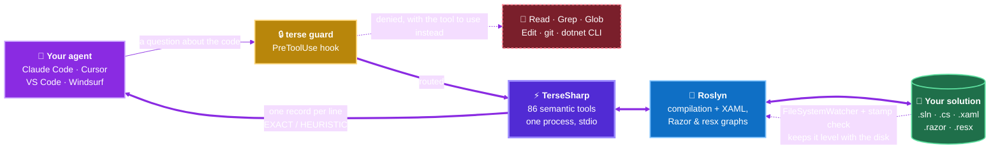

<h1 align="center">TerseSharp</h1>

<p align="center">
  <b>The bridge between your coding agent and your C# codebase.</b><br/>
  A Roslyn-powered <a href="https://modelcontextprotocol.io">MCP</a> server that lets an agent
  navigate, read, edit, refactor, build and test a .NET solution <b>semantically</b> —
  no <code>Read</code>, no <code>Grep</code>, no line-number <code>Edit</code>, no shelling out.
</p>

<p align="center">
  <a href="#-install">
    
  </a>
  &nbsp;
  <a href="#-make-your-agent-actually-use-it">
    
  </a>
</p>

<p align="center">
  <a href="https://github.com/amusleh-spotware-com/terse-sharp/actions/workflows/ci.yml"></a>
  <a href="https://www.nuget.org/packages/TerseSharp"></a>
  <a href="https://www.nuget.org/packages/TerseSharp"></a>
  <a href="LICENSE"></a>
  
  
  
  
  
</p>

<p align="center">
  <a href="#-what-it-saves-you">What it saves</a> ·
  <a href="#-install">Install</a> ·
  <a href="#-make-your-agent-actually-use-it">Enforce it</a> ·
  <a href="#-the-tools">Tools</a> ·
  <a href="#-xaml-razor-and-resx">XAML · Razor · resx</a> ·
  <a href="#-vs-the-alternatives">Comparison</a> ·
  <a href="#-faq">FAQ</a>
</p>

---

> **TL;DR** — Your agent stops reading 2,000-line files and grepping for symbols. It **asks Roslyn**,
> gets the answer in **one call**, and spends the context window on **doing the work** instead of on
> **finding the code**. One install. No IDE, no licence, no Node, no network.
>
> **Fewer tokens → lower bill. Fewer round trips → less waiting. Exact answers → fewer wrong edits.**



## 💸 What it saves you

| Question | With built-in tools | With TerseSharp | |
|---|---|---|---|
| What's on this 2,000-line type? | `Read` → **~6,000 tok** | `get_type_outline` → **~450 tok** | **13×** |
| Who calls this method? | `Grep` + follow-ups → **~4,000 tok** | `find_usages` → **~200 tok** | **20×** |
| Rename across the solution | **~5,000 tok**, misses the interface | `rename_symbol` → **~150 tok**, correct | **30×** |
| Why is the build red? | **~8,000 tok** of MSBuild spew | `build` → **~600 tok** | **13×** |
| What did I just change? | `git diff` → the whole patch | `diff_symbols` → the changed **declarations** | **10×** |
| Does this `{Binding}` bind? | **no static answer exists in WPF** | `xaml_bindings validate=true` | ∞ |

<sub>Asserted by the token-budget suite on every push, not estimated.</sub>

- 💰 **Money.** Ten type reads cost ~60,000 input tokens with `Read`; ~4,500 here — billed **every
  session, on every repo, for every agent you run**.
- ⏱️ **Time.** No IDE, no language server handshake. The workspace loads **once**; repeat XAML,
  `.resx`, DI and file-path questions come from a per-workspace index that **reads no file at all**.
- 🎯 **Fewer wrong edits.** A grep-driven rename misses the interface and hits the comment. An edit
  that introduces a compile error is **rolled back** before the agent reports it done.
- 🔁 **Fewer round trips.** `explore_symbol` folds signature + docs + usage counts + implementations +
  XAML sites into one call; `impact_of` answers *"what breaks if I change this"* **before** the
  rename, not after the build goes red.

**Prime directive: save tokens, increase speed.** A tool that does not beat the built-in it replaces
does not ship.

## ✨ What you get

| | |
|---|---|
| 🧠 **Semantic, never textual** | Real references, not string matches. Every record tagged `EXACT` (Roslyn-resolved) or `HEURISTIC` (text/index), so you always know what you are trusting. |
| ✂️ **Slices, never files** | No tool returns a whole file by default, and an outline prints `OrderService.Submit(Order)` — feed it straight back to any tool. Ambiguous? It lists the candidates instead of guessing. |
| 🛡️ **Compile-gated edits** | An edit that introduces a new compile error is rolled back, and every mutation reports `errors=N (+D) warnings=N (+D)`. Success answers in **one line**; `verbose=true` restores the diff. |
| 🔄 **Always fresh** | A `FileSystemWatcher` plus a content comparison keeps the workspace level with the disk, so a file you just created or an edit from your IDE is already in the answer. |
| 🎨 **Markup that knows your C#** | XAML (WPF · Avalonia · WinUI · MAUI), Razor/Blazor and `.resx` resolved through the compiler: type-checked bindings, a resource graph, component parameters, renames that carry into the markup. |
| 🔍 **Analysis without a licence** | Compiler + every analyzer your projects already reference + dead code, down to `info` severity. No IDE, no ReSharper, no network. |
| 🚫 **Never guesses** | `UNRESOLVED_CONTEXT`, `AmbiguousSymbol`, `SaturatedName`, `HEURISTIC` — where it cannot prove an answer, it says so. A false positive costs an agent more than no answer. |

## 🚀 Install

```bash
dotnet tool install -g TerseSharp
```

Register it with your agent — TerseSharp writes the config itself, you don't hand-edit JSON:

```bash
terse install                       # detects installed clients and registers with all of them
terse install --client claude-code  # or pick one: claude-code | cursor | vscode | windsurf
terse install --skill               # also install the agent skill (teaches the tool-for-built-in swaps)
terse install --guard               # also install the hook that BLOCKS Read/Grep/Edit on C# and XAML
terse doctor                        # verify SDK, MSBuild, workspace load, client registration
```

Then just work — with no arguments the server walks up from the current directory, finds your
`.sln` / `.slnx` / `.slnf` / `.csproj`, and loads it.

<details>
<summary><b>Build from source, configure MCP by hand, Unity, updates</b></summary>

```bash
git clone https://github.com/amusleh-spotware-com/terse-sharp && cd terse-sharp
dotnet pack src/TerseSharp.Server -c Release -o artifacts/nupkg
dotnet tool install -g TerseSharp --add-source artifacts/nupkg --prerelease
```

```json
{
  "mcpServers": {
    "terse-sharp": {
      "command": "terse",
      "args": ["serve", "--workspace", "C:/path/to/YourApp.slnx"]
    }
  }
}
```

Claude Code reads `~/.claude.json`, or `$CLAUDE_CONFIG_DIR/.claude.json` when that variable is set —
`terse install` and `terse doctor` follow it, `--skill` lands in `$CLAUDE_CONFIG_DIR/skills` (else
`~/.claude/skills`), and `doctor` prints the config path it read.

**🎮 Unity** generates a real `.sln` with `Assembly-CSharp.csproj`, so outlines, `find_usages`,
symbol-addressed edits and compile-gated rename across your `MonoBehaviour`s all work. Open the
project in the editor once so the project files exist. Scene graph, inspector values and play-mode
state are out of scope — pair it with a Unity-specific MCP for the editor.

**🔔 Staying current.** One `HEAD` request to GitHub's `releases/latest` — empty body, no token — at
most once every 24 hours, on a background task that never blocks the handshake, cached in
`~/.terse/update`. When a newer release exists the next tool response carries one extra last line
(`UPDATE terse 0.15.2 -> 0.16.0 is available - run: dotnet tool update -g TerseSharp`), once per
server process. After an update, the next `terse serve` rewrites the installed `SKILL.md` and
re-applies the guard hook so both match the new binary. `TERSE_UPDATE=0` turns it off.
</details>

## 🔒 Make your agent actually use it

> [!IMPORTANT]
> The most expensive failure mode is not a slow tool — it is an agent that has TerseSharp installed
> and reaches for `Read`, `Grep` and line-`Edit` anyway, out of habit. **Every token the server saves
> on a call the agent never makes is zero.**

Three levels, weakest to strongest. Use all three.

**1️⃣ Ship the skill** — `terse install --skill`. Costs nothing until it is needed, then teaches the
whole swap table and the working rules.

**2️⃣ Put a hard gate in your agent's instructions** — paste this at the top of `CLAUDE.md`,
`AGENTS.md` or `.cursorrules`. Phrase it as a **rule with the loopholes named**; a soft preference
loses to habit every time.

```markdown
## 🚫 HARD GATE — C#/.NET goes through terse-sharp, built-ins LAST

Before EVERY `Read`, `Grep`, `Glob`, `Edit`, `Write` or code-touching `Bash` call, answer:
**"Is the target a `.cs`, `.csproj`, `.props`, `.targets`, `.sln`/`.slnx`, `.xaml`, `.axaml`,
`.razor` or `.resx` file — or my own working tree?"**
If yes → you are FORBIDDEN from the built-in. No "just this once", no "Grep is faster".

| Never | Always |
|---|---|
| `Read` a `.cs` / `.xaml` / `.razor`   | `get_file_outline` · `get_symbol_source` · `xaml_outline` · `razor_outline` |
| `Grep` a type or member               | `search_symbols` · `find_usages` · `find_implementations` |
| trace a symbol / a blast radius       | `explore_symbol` · `impact_of` |
| grep for DI or HTTP routes            | `find_registrations` · `list_endpoints` |
| `Glob` / `ls`                         | `find_files` (`glob=`, alias `pattern=`) |
| `Edit` a `.cs`                        | `replace_symbol_body` · `replace_symbol` · `add_member` · `rename_symbol` |
| create a new `.cs`                    | `write_text(path, content, force: true)` — then `add_member` |
| `Edit` a `.xaml` / `.resx` / `.razor` | `xaml_set_property` · `resx_set` · `razor_set_attribute` |
| `Bash: git status` / `git diff`       | `changed_files` · `diff_symbols` · `diff_text` |
| `Bash: dotnet build` / `test`         | `build` · `run_tests` · `rerun_failed` |

**CLI text tools are built-ins too** — `grep`, `rg`, `cat`, `sed`, `ls` do not escape this gate
because they run in a shell. Only git **history** (`git log`, `git blame`, `git show <ref>:<path>`)
and `git commit` / `git push` stay on the shell. **An `ERROR` is not permission to switch
toolchains:** read the `remedy:` line and fix the call. When you do drop to a built-in, say why in
the same message.
```

**3️⃣ Enforce it in the harness** — `terse install --guard`. Instructions can be read and then ignored;
a hook cannot, so this is the only level that survives a long session. It registers `terse guard` as a
Claude Code `PreToolUse` hook that **denies** the built-in and names the tool to use instead:

```
$ echo '{"tool_name":"Read","tool_input":{"file_path":"src/App/OrderService.cs"}}' | terse guard
{"hookSpecificOutput":{"hookEventName":"PreToolUse","permissionDecision":"deny",
 "permissionDecisionReason":"TerseSharp guard: Read on 'src/App/OrderService.cs' is C#/.NET source.
  Use the terse-sharp MCP instead - get_file_outline, get_symbol_source, xaml_outline or read_text."}}
```

<details>
<summary><b>Exactly what the guard denies, allows, and why</b></summary>

| | |
|---|---|
| **Denies** | `Read`/`Write`/`Edit`/`MultiEdit`/`NotebookEdit` on `.cs`, `.razor`, `.cshtml`, `.razor.css`, `.razor.js`, `.csproj`, `.props`, `.targets`, `.sln`/`.slnx`/`.slnf`, `.xaml`, `.axaml`, `.paml`, `.resx`, `.resw` · `Glob` for those · `Grep` scoped to them · a shell text read or listing (`grep`, `rg`, `cat`, `head`, `tail`, `sed`, `awk`, `findstr`, `type`, `find`, `fd`, `ls`, `dir`, `tree`, `wc`, `nl`, plus the PowerShell forms) **naming a .NET file**, anywhere in a compound command. A denial names the matching family — `resx_*`, `razor_*`, and for XAML `xaml_find`/`xaml_resolve`/`xaml_styles` **before** `find_files` |
| **Names a tool that can actually do it** | `Write`/`Edit` on a `.cs` path that **does not exist yet** names `write_text(path, content, force=true)`, because no symbol tool creates a file. A denial with no legal move is what produces a silent fallback |
| **Says freshness is handled** | every `.cs` **write** denial adds: a file you create or edit through `write_text` is picked up automatically — no reload, no re-`Read` to check |
| **Denies** | `dotnet build`, `test`, `msbuild`, `vstest`, `format`, `clean` — anywhere in a compound command — because `build`, `run_tests`, `rerun_failed`, `list_tests`, `format`, `cleanup` and `clean` replace them |
| **Allows** | plain `.css`, `.js`, `.csv`, `.csx` — matching is by file **extension** plus the `.razor.css`/`.razor.js` pair, not substring · `dotnet restore`, `pack`, `publish`, `run`, `tool update` — **no TerseSharp tool replaces these**, and a denial that names no alternative is just a wall |
| **Never blocks on failure** | malformed or unexpected hook input allows the call, so a guard fault cannot wedge a session |

Re-running `install --guard` replaces only TerseSharp's own hook and leaves any other hooks in the
same matcher untouched. Remove it by deleting the `terse guard` entry from `settings.json`.
</details>

> [!TIP]
> `terse install --skill --guard` in one go: the skill teaches the swaps, the guard enforces them.

## 🧰 The tools

**86 tools.** One record per line, an explicit `truncated`/`total`, an `EXACT` / `HEURISTIC` tag,
workspace-relative paths, and truncation that names the parameter which narrows it. **Success costs
nothing**: every mutating tool answers a successful edit in one line per changed file, and all 30 of
them take `verbose=true` to restore the diff and `dryRun=true` to preview it. A caveat — a rollback,
`0 files changed`, `compileGate=unavailable`, `workspace=stale`, `UNFIXED`, a `NOT rewritten` list —
always prints in full.

| Group | Tools |
|---|---|
| **Workspace** | `load_workspace` · `workspace_status` · `list_workspaces` · `unload_workspace` · `list_projects` |
| **Navigation** | `search_symbols` · `get_symbol` · `get_file_outline` · `get_type_outline` · `get_symbol_source` · `find_usages` · `find_implementations` · `explore_symbol` · `impact_of` |
| **.NET semantics grep cannot reach** | `find_registrations` (DI: open generics, factories, `Add*` extensions) · `list_endpoints` (ASP.NET Core `Map*`) |
| **Analyze & clean** | `analyze` · `format` · `cleanup` · `clean` · `get_diagnostics` |
| **Edit** | `replace_symbol_body` · `replace_symbol` · `add_member` · `delete_symbol` · `rename_symbol` |
| **Refactor** | `extract_interface` · `move_type_to_file` · `move_type_to_namespace` · `change_signature` · `undo_last_change` |
| **Projects & solutions** | `solution_projects` · `solution_add_project` · `solution_remove_project` · `project_create` · `project_properties` · `project_set_property` · `project_add_reference` · `project_remove_reference` · `package_list` · `package_add` · `package_remove` |
| **XAML** | `xaml_outline` · `xaml_names` · `xaml_resources` · `xaml_resolve` · `xaml_styles` · `xaml_bindings` · `xaml_validate` · `xaml_find` · `xaml_codebehind` · `xaml_localization` · `xaml_set_property` · `xaml_add_element` · `xaml_remove_element` |
| **Localization (`.resx`/`.resw`)** | `resx_files` · `resx_get` · `resx_find` · `resx_usages` · `resx_set` · `resx_remove` · `resx_rename` · `resx_validate` |
| **Razor / Blazor** | `razor_outline` · `razor_component` · `razor_find` · `razor_bindings` · `razor_codebehind` · `razor_validate` · `razor_set_attribute` · `razor_add_element` · `razor_remove_element` · `razor_set_directive` |
| **Files** | `read_text` · `write_text` · `edit_text` · `find_files` · `search_text` · `search_regex` |
| **Git** | `changed_files` · `diff_symbols` · `diff_text` |
| **Build & test** | `build` · `run_tests` · `rerun_failed` · `list_tests` |

<details>
<summary><b>What each one replaces</b></summary>

| Instead of | Use | Why |
|---|---|---|
| `Read` a `.cs` file | `get_file_outline` · `get_symbol_source` | types, members and line ranges — or one member, never the file; `symbolIds=[…]` returns several in one response |
| `Grep` a type or member name | `search_symbols` | declarations only; CamelHump (`OSvc` → `OrderService`) |
| `Grep` to find callers | `find_usages` | real references, each marked `src` or `test`; `containers=true` names the member each sits in |
| three calls to learn a symbol | `explore_symbol` · `impact_of` | signature, docs, usage counts, implementations and XAML sites in one call — and every file and project a change would touch, before you touch it |
| grepping `Program.cs` for DI | `find_registrations` · `list_endpoints` | open generics, factory delegates and `Add*` extensions grep cannot see |
| `Edit` a `.cs` file | `replace_symbol_body` · `add_member` | addressed by symbol, immune to line drift; several declarations land as one compile-gated edit |
| creating or deleting a file | `write_text(path, content, force: true)` · `write_text(path, delete: true)` | containment-checked; the new type resolves on the very next call |
| `Grep -C3`, then `Read` around the hit | `search_text(query, context=3)` | the surrounding lines arrive on the hit's own record; `unique=true` collapses repeats to `x<count>`; `root=` searches outside the workspace |
| `tail -n 200` on a log | `read_text(path, tail=200)` | a clipped read ends with `next: startLine=…`, and `maxChars=` bounds a file whose lines are too long for `maxLines` |
| `Read` a whole `.md` to find a section | `read_text(headings=true)`, then `section="## Commands"` | the heading map first, then that section only — and `edit_text` replaces a whole section with no `oldText` at all |
| `Edit` a `.xaml` / `.resx` / `.razor` | `xaml_set_property` · `resx_set` · `razor_set_attribute` | addressed by element or key; formatting, ordering and BOM preserved, and a Razor edit re-runs the generator |
| find-and-replace a name | `rename_symbol` | solution-wide, incl. interfaces, overrides, doc crefs **and XAML** |
| `Bash: git status` / `git diff` | `changed_files` · `diff_symbols` · `diff_text` | one line per file, then every hunk mapped onto the declaration containing it as a symbol id you feed straight to `get_symbol_source`; the raw hunks only when you ask. All three take `baseRef=` |
| `Bash: dotnet build` / `test` | `build` · `run_tests` · `rerun_failed` · `list_tests` | deduplicated diagnostics, no MSBuild spew; green is one line **whatever it warned about**, red lists errors only; `project=` takes a project name, `configuration=`/`targetFramework=` map to `-c`/`-f` |
| `Bash: dotnet format` / `clean` | `format` · `cleanup fix=all` · `clean` | compile-gated code fixes, a one-line verdict, freed-byte counters — never raw CLI output |
| a per-file analyzer sweep | `analyze path=src/**/*.cs` · `analyze changed=true` | a file, a directory, a glob, or just what you touched — one call instead of one per file |
| `Glob` for `*.sln` in an unfamiliar repo | `load_workspace discover=true` | every solution and project under a directory, shallowest first, loading none of them |
| `Grep` in non-code files | `search_text` · `search_regex` | the count line counts matching lines; `bin`, `obj`, `.git`, `artifacts`, `TestResults` and symlinks are skipped |

</details>

### 🔍 Analysis, tests and cleanup without a licence

`analyze` runs the **compiler plus every analyzer your projects already reference** — CA rules,
StyleCop, SonarAnalyzer, Roslynator — down to `info` and `hidden` severity, which a normal build
hides, and reports **dead code** in the same list. `cleanup fix=style|analyzers|all` applies those
analyzers' code fixes in-process, compile-gated and rolled back if they break the build, with
`UNFIXED <id>` for anything no fixer covers; `format verify=true` replaces `--verify-no-changes` with
one verdict line. Generated code is never rewritten, and `clean` reports `projects=`, `files=` and
`freedBytes=` instead of MSBuild output.

A red suite arrives as counters, then each failure's message, expected/actual and **one** source
frame — capped at 20 failures, so it cannot flood the context:

```
2 failures
passed=3 failed=2 skipped=1 total=6 durationMs=229 exitCode=1

FAIL Fixture.Trading.Tests.DeliberateOutcomesTests.FailsAssertion (2 ms)
  Assert.Equal() Failure: Values differ
  Expected: 4
  Actual:   5
  at tests/Fixture.Trading.Tests/DeliberateOutcomesTests.cs:26
```

A filter that matches nothing says so instead of looking green, and a run that produced no results
never reports `0 failures`.

<details>
<summary><b>🔄 Freshness, memory and worktrees</b></summary>

A loaded workspace is **not** a snapshot. A `FileSystemWatcher` nominates changed paths and a
**content comparison** decides, so a dropped or out-of-order OS event can delay a refresh but never
corrupt one. Sync is lazy — a `git checkout` storm costs one reload, not one per file — and doubt is
a rebuild: a changed `.csproj`/`.props`/`.sln`/`global.json`, a `.cs` added or removed, or a watcher
overflow all reload rather than guess. Six generation counters (Code, Project, Xaml, Resx, Razor,
Files) keep a `.cs` edit from invalidating the XAML graph, and `undo_last_change` drops a snapshot an
external change overtook rather than reverting someone else's work.

```
watch=active gen=c12/p1/x3/r0/rz2/f4 pending=0 lastSyncMs=8 gaps=0
index=xaml(hit=12 miss=1 files=9) resx(hit=4 miss=1 families=2) razor(hit=3 miss=1 files=10) paths(hit=7 miss=1 files=31324)
```

**Repeat questions read no file.** The `xaml_*` and `resx_*` tools, `find_registrations` and
`list_endpoints` share one index per workspace; `find_files`, `search_text` and `search_regex` answer
from a path index rather than walking the tree, so a repeat call on a 31,000-file solution is a glob
match over memory.

**Four solutions stay loaded at once** (`--max-workspaces`, `TERSE_MAX_WORKSPACES`) — a loaded
workspace costs what Roslyn costs, roughly 3 GB on a 148-project, 31,000-document solution once its
compilations exist. Unloading ends with a compacting gen 2 collection, measured 3418 MB → 652 MB,
because dropping the last reference alone gave back 57 MB. **A workspace idle for 15 minutes gives
its compilations back** (`--idle-minutes`, and any idle workspace once the heap passes 2 GB),
reported as `idle=<n>m compilations=dropped` rather than left as a silent pause. On a multi-targeted
solution, `load_workspace(targetFramework: "net10.0")` picks the framework every semantic tool answers
from, and it is printed rather than left implicit.

Run several agents at once across git worktrees and unrelated repos: every answer names its worktree
and branch, and an ambiguous request returns `ERROR AmbiguousWorkspace` listing the candidates
**instead of guessing** — answering from the wrong checkout is the one failure an agent cannot detect.
`load_workspace(reload: true)` forces a reload; `--no-watch` (or `TERSE_WATCH=0`) turns the watcher
off for constrained containers, and `--read-only` makes every mutating tool refuse and touch nothing.
</details>

## 🎨 XAML, 🧩 Razor and 🌍 `.resx`

TerseSharp holds the markup tree **and** the Roslyn compilation in one process — so it answers the
questions no text tool can. **WPF · Avalonia (`.axaml`) · WinUI · MAUI**, dialect detected from the
markup namespace.

**Does this binding actually bind?** WPF has **no** compile-time binding check at all — a typo fails
silently to debug output. `xaml_bindings validate=true` resolves the data context from `x:DataType`
or `d:DataContext`, maps the prefix through its `clr-namespace:`, and walks every path segment
against the real symbol:

```
src/Views/BoundView.xaml:7  EXACT  TextBlock.Text  {Binding Symbol}  OK Symbol on Trading.OrderViewModel
src/Views/BoundView.xaml:9  EXACT  TextBlock.Text  {Binding Symbl}   ERROR no member 'Symbl'; nearest 'Symbol'
```

With no data context in scope the record says `UNRESOLVED_CONTEXT` and stays `HEURISTIC` — it never
reports an error it cannot prove. `xaml_resolve AccentBrush` reports every declaration of a key with
its `scope=local|theme` instead of reading `App.xaml` and each merged dictionary in order, and the
same index backs `xaml_validate`, `xaml_styles` (implicit and keyed styles with the `BasedOn` chain)
and `xaml_localization` (every `x:Uid` joined to its resource entry).

**The Blazor bug nothing else catches.** An attribute matching no `[Parameter]` compiles **clean** and
throws `InvalidOperationException` the first time the component renders:

```
RZR002  src/App/Components/Home.razor:6   Card.Bogus      UNKNOWN_PARAMETER  Card has no [Parameter] with that name - InvalidOperationException at render
RZR001  src/App/Components/Home.razor:8   MudButton       UNKNOWN_COMPONENT  resolves to no component - it renders as a plain HTML tag
RZR006  src/App/Components/Legacy.razor:1 /order/{Id:int} DUPLICATE_ROUTE    also declared by Components/Detail.razor - AmbiguousMatchException on navigation
```

`RZR000`–`RZR010` is the full set — a missing `[EditorRequired]`, a `@bind` with no setter, a route
parameter with no property, a mistyped `@ref`, an `@inject` nothing registers, markup that will not
parse — reported at the `.razor` line, never at the generated file under `obj/`. `razor_component`
prints a component's full `[Parameter]` list, including one from a referenced package, and the C#
edit tools reach straight into `@code`, so the code half of a component needs no separate tool.

**Translation bugs no compiler catches.** A 500-key `.resx` costs ~12,000 tokens to read and a
neutral + `fr` + `de` family ~36,000. `resx_validate` answers instead:

```
RESX001  src/App/Strings.de.resx  Order_Submit  MISSING      no de value; neutral="Submit order"
RESX002  src/App/Strings.fr.resx  Order_Total   PLACEHOLDER  this culture has {2} which the neutral value does not - string.Format throws FormatException
```

**Renames carry into markup.** `rename_symbol` rewrites `Click="…"` and `{Binding …}` — but only
where an `x:Class` or `x:DataType` **proves** the reference; anything else is listed `NOT rewritten`
rather than rewritten on a guess. Renaming a Blazor component renames its file plus its `.razor.cs`,
`.razor.css` and `.razor.js` siblings. Every markup and resource write is surgical: only the
addressed element is rewritten, so schema headers, ordering, indentation, line endings and byte order
marks survive.

## ⚔️ Vs the alternatives

| | **TerseSharp** | Rider MCP | `RoslynMcpServer` | `csharp-lsp-mcp` |
|---|---|---|---|---|
| Needs a running IDE | **No** | Yes (licensed, solution open) | No | No |
| Setup | **one command** | IDE + licence | tool install | tool install + `csharp-ls` |
| C# semantics | **Roslyn, exact** | Roslyn, exact | Roslyn, exact | via `csharp-ls` |
| Can edit / refactor | **Yes** | Yes | Partial | Rename preview |
| Compile-gated edits, rollback and `undo_last_change` | **Yes** | No | No | No |
| Response size budgeted in CI · one-line success | **Yes** | No | No | No |
| Symbol addressable by short name | **Yes, round-trips** | Ids only | Ids only | Positions |
| `EXACT` / `HEURISTIC` on every result | **Yes** | No | No | No |
| Type-checked XAML bindings + resource graph | **Yes** | Inspections only | No | No |
| XAML-aware rename | **Yes** | Partial | No | No |
| Razor / Blazor component API + validation | **Yes** | Inspections only | No | No |
| `.resx` / `.resw` read, edit and translation lint | **Yes** | No | No | No |
| DI registrations & ASP.NET endpoints as tools | **Yes** | No | No | No |
| The diff mapped onto declarations | **Yes** | No | No | No |
| Analyzers + dead code, no licence | **Down to `info`** | Yes (licensed) | No | No |
| `build` / `run_tests` / `rerun_failed` as tools | **Yes** | Yes | No | No |
| Project / package / solution editing | **Yes** | Partial | No | No |
| Live disk sync · parallel worktrees · `--read-only` | **Yes** | IDE-managed | No | No |
| Ships an agent skill + a `PreToolUse` guard hook | **Yes** | No | No | No |
| E2E test per advertised tool | **Required** | — | — | — |

<sub>Compared against public documentation and tool lists at time of writing. Something out of date?
Open a PR — the table is a claim like any other.</sub>

**Why it's fast:** Rider MCP's floor is structural — `agent → MCP plugin (JVM) → RD protocol →
ReSharper backend`, on a process also driving a GUI and an inspection daemon. TerseSharp is
`agent → one process → Roslyn`, with the workspace loaded once, semantic queries scoped to the owning
project and its dependents, and responses as compact text rather than JSON.

## ❓ FAQ

<details>
<summary><b>Does it work without Visual Studio, Rider or a licence? Which agents?</b></summary>

Yes — a self-contained .NET global tool driving Roslyn and MSBuild directly. No IDE, no ReSharper, no
language server, no API key, no network call to answer a question. Anything that speaks MCP over
stdio works; `terse install` registers Claude Code, Cursor, VS Code and Windsurf automatically.
</details>

<details>
<summary><b>Will it edit my code behind my back?</b></summary>

Only when your agent calls a mutating tool, and all 30 of them take `dryRun=true`. The C#, Razor and
refactoring edits are additionally **compile-gated** and reversible with `undo_last_change`. The
`.resx`, `.xaml` and `project_*` / `package_*` / `solution_*` writers are file writes — surgical and
formatting-preserving, but outside the compile gate and outside undo, so preview those with `dryRun`.
`--read-only` makes every mutating tool refuse and touch nothing.
</details>

<details>
<summary><b>What about huge solutions, VB.NET or F#?</b></summary>

The workspace loads once per solution and is reused (LRU, default 4), and responses are bounded and
declare their truncation, so a 5,000-type solution answers in the same shape as a 50-type one. VB and
F# projects load without breaking navigation, but the language tools are C#-first and refuse them
with a clear message rather than guessing.
</details>

<details>
<summary><b>Databases, debugging, profiling?</b></summary>

Out of scope on purpose. Git is read-only — the working tree served as tools, history left to the CLI
— and a debugger, profiler or SQL client is a different product; six shallow tools would be worse
than none.
</details>

## 🤝 Contributing · 📄 License

See [CONTRIBUTING.md](CONTRIBUTING.md). Two rules that aren't negotiable: **a tool without an E2E test
isn't done**, and **a tool that doesn't beat the built-in it replaces doesn't ship**. Changes are in
[CHANGELOG.md](CHANGELOG.md), releases in [RELEASING.md](RELEASING.md), security in
[SECURITY.md](SECURITY.md). MIT Licensed — see [LICENSE](LICENSE).

<p align="center">
  <sub>Built on <a href="https://github.com/dotnet/roslyn">Roslyn</a> and the
  <a href="https://github.com/modelcontextprotocol/csharp-sdk">MCP C# SDK</a>.</sub><br/>
  <sub><b>C# MCP server</b> · Roslyn MCP · .NET code navigation for AI agents · WPF &amp; Avalonia XAML MCP ·
  Blazor / Razor MCP · <code>.resx</code> localization MCP · token-efficient agent tooling</sub>
</p>
