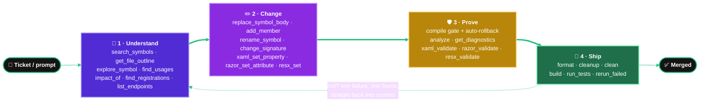
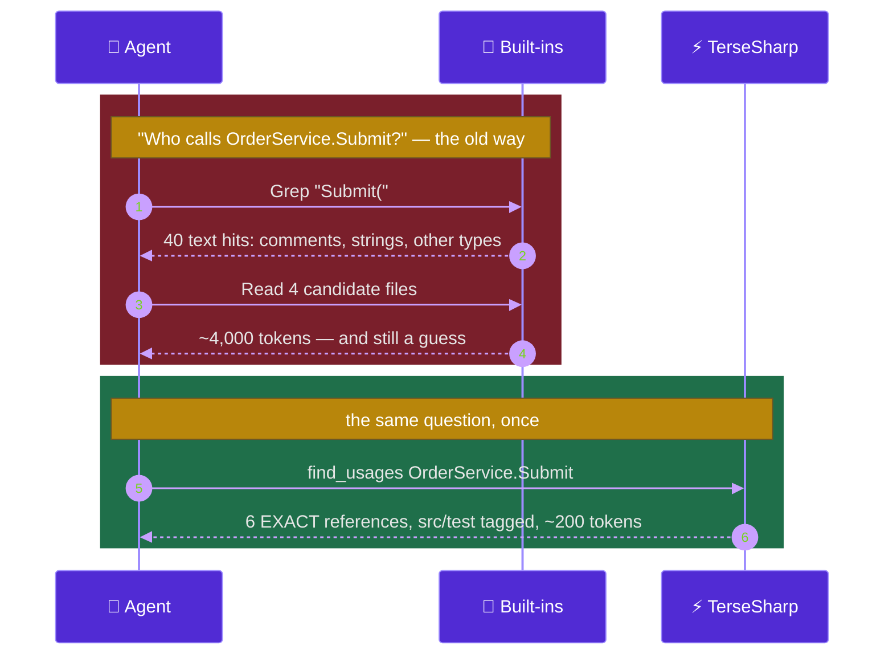

<h1 align="center">TerseSharp</h1>

<p align="center">
  <b>The bridge between your coding agent and your C# codebase.</b><br/>
  A Roslyn-powered <a href="https://modelcontextprotocol.io">MCP</a> server that lets an agent
  navigate, read, edit, refactor, build and test a .NET solution <b>semantically</b> —
  no <code>Read</code>, no <code>Grep</code>, no line-number <code>Edit</code>, no shelling out.
</p>

<p align="center">
  <a href="#-install">
    
  </a>
  &nbsp;
  <a href="#-make-your-agent-actually-use-it">
    
  </a>
</p>

<p align="center">
  <a href="https://github.com/amusleh-spotware-com/terse-sharp/actions/workflows/ci.yml"></a>
  <a href="https://github.com/amusleh-spotware-com/terse-sharp/actions/workflows/release.yml"></a>
  <a href="https://www.nuget.org/packages/TerseSharp"></a>
  <a href="https://www.nuget.org/packages/TerseSharp"></a>
  <a href="LICENSE"></a>
  
  
  
  
  
  
  <a href="CONTRIBUTING.md"></a>
</p>

<p align="center">
  <a href="#-where-tersesharp-sits">Where it sits</a> ·
  <a href="#-what-it-saves-you">What it saves</a> ·
  <a href="#-install">Install</a> ·
  <a href="#-make-your-agent-actually-use-it">Enforce it</a> ·
  <a href="#-the-tools">Tools</a> ·
  <a href="#-xaml-that-knows-about-your-c">XAML</a> ·
  <a href="#-razor-and-blazor-resolved-through-the-compiler">Razor</a> ·
  <a href="#-vs-the-alternatives">Comparison</a> ·
  <a href="#-faq">FAQ</a>
</p>

---

> **TL;DR** — Your agent stops reading 2,000-line files and grepping for symbols. It **asks Roslyn**,
> gets the answer in **one call**, and spends the context window on **doing the work** instead of on
> **finding the code**. One install. No IDE, no licence, no Node, no network.
>
> **Fewer tokens → lower bill. Fewer round trips → less waiting. Exact answers → fewer wrong edits.**

## 🌉 Where TerseSharp sits

Your agent talks to TerseSharp; TerseSharp talks to Roslyn; Roslyn already knows every answer about
your solution. Nothing in between reads a file the agent has to pay for.


### …and where it sits in the loop

Every stage has a tool that answers in one call, and each stage verifies the one before it — so a
broken edit never leaves the loop.



---

## 💸 What it saves you

Roslyn already knows the answer **semantically**; TerseSharp hands it over in the shape the agent needs
— a signature list instead of a file, real call sites instead of string matches.

| Question | With built-in tools | With TerseSharp | |
|---|---|---|---|
| What's on this 2,000-line type? | `Read` → **~6,000 tok** | `get_type_outline` → **~450 tok** | **13×** |
| Who calls this method? | `Grep` + follow-ups → **~4,000 tok** | `find_usages` → **~200 tok** | **20×** |
| Rename across the solution | **~5,000 tok**, misses the interface | `rename_symbol` → **~150 tok**, correct | **30×** |
| Why is the build red? | **~8,000 tok** of MSBuild spew | `build` → **~600 tok** | **13×** |
| 2 failures out of 312 tests | full test output | 2 failures + assertion lines | **10×** |
| Does this `{Binding}` bind? | **no static answer exists in WPF** | `xaml_bindings validate=true` | ∞ |

<sub>Asserted by the token-budget suite on every push and pull request, not estimated.</sub>

- 💰 **Money.** Ten type reads in a session cost ~60,000 input tokens with `Read`; ~4,500 here. That
  gap is billed **every session, on every repo, for every agent you run.**
- ⏱️ **Time.** No IDE to launch, no language server to hand-shake, no solution to re-open per query.
  The workspace loads **once**; every later question is answered from the same in-memory compilation,
  and repeat XAML / `.resx` / DI questions come from a per-workspace index that **reads no file at all**.
- 🎯 **Fewer wrong edits.** A grep-driven rename misses the interface and hits the comment. A
  Roslyn-driven one doesn't — and an edit that introduces a compile error is **rolled back** before
  the agent ever sees it as done.

### ⏱️ Round trips, not just bytes

The real cost isn't the answer — it's the **five calls the agent makes to become sure of it**.



One call answers what a grep-and-read loop only approximates. `explore_symbol` folds *signature + docs
+ usage counts + implementations + XAML sites* into one response; `impact_of` answers *"what breaks if
I change this"* **before** the rename, not after the build goes red.

**Prime directive: save tokens, increase speed.** A tool that does not beat the built-in it replaces
does not ship.

---

## ✨ What you get

| | |
|---|---|
| 🧠 **Semantic, never textual** | Real references, not string matches. Every record tagged `EXACT` (Roslyn-resolved) or `HEURISTIC` (text/index) so you always know what you are trusting. |
| ✂️ **Slices, never files** | No tool returns a whole file by default, and an outline prints `OrderService.Submit(Order)` — feed it straight back to any tool. Ambiguous? It lists the candidates instead of guessing. |
| 🛡️ **Compile-gated edits** | An edit that introduces a new compile error is rolled back. Every mutation reports `errors=N (+D) warnings=N (+D)` — no separate `analyze` needed. |
| 🔄 **Always fresh** | A `FileSystemWatcher` plus a content comparison keeps the workspace level with the disk, so a file you just created or an edit from your IDE is already in the answer. |
| 🎨 **Markup that knows your C#** | XAML (WPF · Avalonia · WinUI · MAUI) and Razor/Blazor resolved through the compiler: type-checked bindings, a resource graph, component parameters, renames that carry into the markup. |
| 🔍 **Analysis without a licence** | Compiler + every analyzer your projects already reference + dead code, down to `info` severity. No IDE, no ReSharper, no network. |
| 🧪 **Tests an agent can act on** | Counters, then each failure's message, expected/actual and **one** source frame — capped so a red suite cannot flood the context. |
| 🌲 **Parallel worktrees** | Many workspaces at once, across repos and git worktrees. Every answer names its worktree and branch. |
| 🚫 **Never guesses** | `UNRESOLVED_CONTEXT`, `AmbiguousSymbol`, `SaturatedName`, `HEURISTIC` — where it cannot prove an answer, it says so. A false positive costs an agent more than no answer. |

---

## 🚀 Install

One command. No IDE, no licence, no Node, no Python, no language server, no API key, no network.

```bash
dotnet tool install -g TerseSharp
```

Register it with your agent — TerseSharp writes the config itself, you don't hand-edit JSON:

```bash
terse install                       # detects installed clients and registers with all of them
terse install --client claude-code  # or pick one: claude-code | cursor | vscode | windsurf
terse install --skill               # also install the agent skill (teaches the tool-for-built-in swaps)
terse install --guard               # also install the hook that BLOCKS Read/Grep/Edit on C# and XAML
terse doctor                        # verify SDK, MSBuild, workspace load, client registration
```

Then just work — with no arguments the server walks up from the current directory, finds your
`.sln` / `.slnx` / `.slnf` / `.csproj`, and loads it.

<details>
<summary><b>Build from source, or configure MCP by hand</b></summary>

```bash
git clone https://github.com/amusleh-spotware-com/terse-sharp && cd terse-sharp
dotnet pack src/TerseSharp.Server -c Release -o artifacts/nupkg
dotnet tool install -g TerseSharp --add-source artifacts/nupkg --prerelease
```

```json
{
  "mcpServers": {
    "terse-sharp": {
      "command": "terse",
      "args": ["serve", "--workspace", "C:/path/to/YourApp.slnx"]
    }
  }
}
```

Claude Code reads `~/.claude.json`, or `$CLAUDE_CONFIG_DIR/.claude.json` when that variable is set —
`terse install` and `terse doctor` follow it, `--skill` lands in `$CLAUDE_CONFIG_DIR/skills` (else
`~/.claude/skills`), and `doctor` prints the config path it read.
</details>

<details>
<summary><b>🎮 Unity projects</b></summary>

Unity generates a real `.sln` with `Assembly-CSharp.csproj` and friends, so TerseSharp works on Unity
game code exactly as on any other solution — outlines, `find_usages`, symbol-addressed edits,
compile-gated rename across your `MonoBehaviour`s, `analyze` with whatever analyzers you reference.
Run `terse install` from the folder holding the generated `.sln`.

**Open the project in the Unity editor once first** (or *Assets → Open C# Project*) so the `.sln` and
`.csproj` files exist — TerseSharp reads them, it does not generate them. **Editor state is out of
scope**: no scene graph, inspector values or play-mode state. It answers questions about your **C#
code**; pair it with a Unity-specific MCP for the editor.
</details>

### ✂️ Success costs nothing

Every mutating tool answers a successful edit in **one line per changed file** —
`replace_symbol applied` · `src/App/OrderService.cs  changedLines=3` · `errors=0 (+0) warnings=0 (+0)` —
instead of echoing a diff of text the agent just wrote. All 30 of them take `verbose=true` to restore
it in full. The short form is only ever emitted when there is nothing else to say: `dryRun=true` is
never condensed — there the diff *is* the answer — and **every caveat prints in full regardless**, from
a rollback or a new compile error to `0 files changed`, `compileGate=unavailable`, `workspace=stale`,
`UNFIXED`, `designerStale` and the `NOT rewritten` list a XAML-aware rename leaves.

<details>
<summary><b>🔔 Staying current — one cached <code>HEAD</code> a day</b></summary>

A new release costs **one `HEAD` request to GitHub's `releases/latest` — empty body, no token, no rate
limit — at most once every 24 hours**, on a background task that never blocks the MCP handshake or a
tool call, cached in `~/.terse/update` (a failed check too). When a newer release exists, the **next
tool response carries one extra last line** — the one channel every MCP client hands to its agent:

```
UPDATE terse 0.15.2 -> 0.16.0 is available - run: dotnet tool update -g TerseSharp
```

Once per server process, never repeated; the response above it is untouched, and `terse doctor` answers
on demand. After an update, the next `terse serve` rewrites the installed `SKILL.md` and re-applies the
`terse guard` hook so both match the new binary — only for what you installed, and `doctor` reports it
as `assets: skill=current guard=current`. `TERSE_UPDATE=0` turns the check, the state file and the
refresh off; `TERSE_UPDATE_URL` points them at an enterprise mirror or a test stub.
</details>

---

## 🔒 Make your agent actually use it

> [!IMPORTANT]
> The most expensive failure mode is not a slow tool — it is an agent that has TerseSharp installed
> and reaches for `Read`, `Grep` and line-`Edit` anyway, out of habit. **Every token the server saves
> on a call the agent never makes is zero.**

Three levels, weakest to strongest. Use all three.

**1️⃣ Ship the skill** — `terse install --skill`. Costs nothing until it is needed, then teaches the
whole swap table and the working rules.

**2️⃣ Put a hard gate in your agent's instructions** — paste this at the top of `CLAUDE.md`,
`AGENTS.md` or `.cursorrules`. Phrase it as a **rule with the loopholes named**; a soft preference
loses to habit every time.

```markdown
## 🚫 HARD GATE — C#/.NET goes through terse-sharp, built-ins LAST

Before EVERY `Read`, `Grep`, `Glob`, `Edit`, `Write` or code-touching `Bash` call, answer:
**"Is the target a `.cs`, `.csproj`, `.props`, `.targets`, `.sln`/`.slnx`, `.xaml` or `.axaml` file?"**
If yes → you are FORBIDDEN from the built-in. No "just this once", no "Grep is faster".

| Never | Always |
|---|---|
| `Read` a `.cs` / `.xaml`      | `get_file_outline` · `get_symbol_source` · `xaml_outline` |
| `Grep` a type or member       | `search_symbols` · `find_usages` · `find_implementations` |
| `Glob` / `ls`                 | `find_files` |
| `Edit` a `.cs`                | `replace_symbol_body` · `replace_symbol` · `add_member` · `rename_symbol` |
| create a new `.cs`            | `write_text(path, content, force: true)` — then `add_member` |
| `Edit` a `.xaml`              | `xaml_set_property` |
| `Bash: dotnet build` / `test` | `build` · `run_tests` |

**CLI text tools are built-ins too** — `grep`, `rg`, `cat`, `sed`, `ls` do not escape this gate
because they run in a shell. **An `ERROR` is not permission to switch toolchains:** read the `remedy:`
line and fix the call. When you do drop to a built-in, say why in the same message.
```

**3️⃣ Enforce it in the harness** — `terse install --guard`. Instructions can be read and then ignored;
a hook cannot, so this is the only level that survives a long session. It registers `terse guard` as a
Claude Code `PreToolUse` hook that **denies** the built-in and names the tool to use instead:

```
$ echo '{"tool_name":"Read","tool_input":{"file_path":"src/App/OrderService.cs"}}' | terse guard
{"hookSpecificOutput":{"hookEventName":"PreToolUse","permissionDecision":"deny",
 "permissionDecisionReason":"TerseSharp guard: Read on 'src/App/OrderService.cs' is C#/.NET source.
  Use the terse-sharp MCP instead - get_file_outline, get_symbol_source, xaml_outline or read_text."}}
```

<details>
<summary><b>Exactly what the guard denies, allows, and why</b></summary>

| | |
|---|---|
| **Denies** | `Read`/`Write`/`Edit`/`MultiEdit`/`NotebookEdit` on `.cs`, `.razor`, `.cshtml`, `.razor.css`, `.razor.js`, `.csproj`, `.props`, `.targets`, `.sln`/`.slnx`/`.slnf`, `.xaml`, `.axaml`, `.paml`, `.resx`, `.resw` · `Glob` for those · `Grep` scoped to them by `glob`, `path` or `type` · a shell text read or listing (`grep`, `rg`, `cat`, `head`, `tail`, `sed`, `awk`, `findstr`, `type`, `find`, `fd`, `ls`, `dir`, `tree`, `wc`, `nl`, plus the PowerShell forms `Get-ChildItem`, `gci`, `Get-Content`, `gc`, `Select-String`, `sls`) **naming a .NET file**, anywhere in a compound command. A denial names the matching tool family: `resx_*` for a resource file, `razor_*` for Razor markup, and for a XAML glob or shell walk it names `xaml_find`, `xaml_resolve` and `xaml_styles` **before** `find_files`, because globbing XAML is nearly always a search for a key, a name or a style |
| **Names a tool that can actually do it** | `Write`/`Edit` on a `.cs` path that **does not exist yet** names `write_text(path, content, force=true)`, because no symbol tool creates a file. Pointing a stuck agent at `replace_symbol_body` for a file that is not there is the dead end that produced a silent `edit_text force=true` fallback in 0.8.0. A relative path the hook process cannot resolve is offered creation only as the "if it does not exist yet" case |
| **Says freshness is handled** | every `.cs` **write** denial adds: a file you create or edit through `write_text` is picked up automatically — no reload, no re-`Read` to check |
| **Allows** | everything else, including plain `.css`, `.js`, `.csv` and `.csx` — matching is by **file extension** plus the `.razor.css`/`.razor.js` pair, not substring, so an ordinary stylesheet stays editable |
| **Denies** | `dotnet build`, `dotnet test`, `dotnet msbuild`, `dotnet vstest`, bare `msbuild`, `dotnet format`, `dotnet clean` — anywhere in a compound command — because `build`, `run_tests`, `rerun_failed`, `list_tests`, `format`, `cleanup` and `clean` replace them |
| **Allows** | `dotnet restore`, `pack`, `publish`, `run`, `tool update` — **no TerseSharp tool replaces these**, and a denial that names no alternative is just a wall. Also `git add OrderService.cs`, and a listing that names no .NET file |
| **Never blocks on failure** | malformed or unexpected hook input allows the call, so a guard fault cannot wedge a session |

Re-running `install --guard` replaces only TerseSharp's own hook and leaves any other hooks in the
same matcher untouched. Remove it by deleting the `terse guard` entry from `settings.json`.
</details>

> [!TIP]
> `terse install --skill --guard` in one go: the skill teaches the swaps, the guard enforces them.

---

## 🧰 The tools

**83 tools.** One record per line, an explicit `truncated`/`total`, an `EXACT` / `HEURISTIC` tag,
workspace-relative paths, and truncation that names the parameter which narrows it.

| Group | Tools |
|---|---|
| **Workspace** | `load_workspace` · `workspace_status` · `list_workspaces` · `unload_workspace` · `list_projects` |
| **Navigation** | `search_symbols` · `get_symbol` · `get_file_outline` · `get_type_outline` · `get_symbol_source` · `find_usages` · `find_implementations` · `explore_symbol` · `impact_of` |
| **.NET semantics grep cannot reach** | `find_registrations` · `list_endpoints` |
| **Analyze & clean** | `analyze` · `format` · `cleanup` · `clean` · `get_diagnostics` |
| **Edit** | `replace_symbol_body` · `replace_symbol` · `add_member` · `delete_symbol` · `rename_symbol` |
| **Refactor** | `extract_interface` · `move_type_to_file` · `move_type_to_namespace` · `change_signature` · `undo_last_change` |
| **Projects & solutions** | `solution_projects` · `solution_add_project` · `solution_remove_project` · `project_create` · `project_properties` · `project_set_property` · `project_add_reference` · `project_remove_reference` · `package_list` · `package_add` · `package_remove` |
| **XAML** | `xaml_outline` · `xaml_names` · `xaml_resources` · `xaml_resolve` · `xaml_styles` · `xaml_bindings` · `xaml_validate` · `xaml_find` · `xaml_codebehind` · `xaml_localization` · `xaml_set_property` · `xaml_add_element` · `xaml_remove_element` |
| **Localization (`.resx`/`.resw`)** | `resx_files` · `resx_get` · `resx_find` · `resx_usages` · `resx_set` · `resx_remove` · `resx_rename` · `resx_validate` |
| **Razor / Blazor** | `razor_outline` · `razor_component` · `razor_find` · `razor_bindings` · `razor_codebehind` · `razor_validate` · `razor_set_attribute` · `razor_add_element` · `razor_remove_element` · `razor_set_directive` |
| **Files** | `read_text` · `write_text` · `edit_text` · `find_files` · `search_text` · `search_regex` |
| **Build & test** | `build` · `run_tests` · `rerun_failed` · `list_tests` |

<details>
<summary><b>What each one replaces</b></summary>

| Instead of | Use | Why |
|---|---|---|
| `Read` a `.cs` file | `get_file_outline` · `get_symbol_source` | types, members and line ranges — or one member, never the file; `usings=true` adds the file's using directives |
| quoting a 200-character symbol id | `OrderService.Submit(Order)` | every reference an outline prints resolves back; `ids=full` for the ids |
| `Grep` a type or member name | `search_symbols` | declarations only; CamelHump (`OSvc` → `OrderService`) |
| `Grep` to find callers | `find_usages` | real references, each marked `src` or `test`; `containers=true` names the member each sits in |
| three calls to learn a symbol | `explore_symbol` | signature, docs, usage counts, implementations, XAML sites — one call |
| guessing a rename's blast radius | `impact_of` | every referencing file and every project that recompiles, before you touch it |
| grepping `Program.cs` for DI | `find_registrations` · `list_endpoints` | open generics, factory delegates and `Add*` extensions grep cannot see |
| `Edit` a `.cs` file | `replace_symbol_body` · `add_member` | addressed by symbol, immune to line drift; several declarations land as one compile-gated edit |
| creating a new `.cs` file | `write_text(path, content, force: true)` | the new type resolves on the very next call |
| `Edit` a `.xaml` file | `xaml_set_property` | addressed by element, formatting preserved |
| `Read` / `Edit` a `.resx` file | `resx_get` · `resx_set` · `resx_remove` · `resx_rename` | values per culture with `MISSING` marked; schema header, ordering, indentation and BOM preserved |
| `Read` a `.razor` / `.cshtml` file | `razor_outline` · `razor_component` | the component tree with every `<Card />` resolved to its type, and its full `[Parameter]` list |
| `Edit` a `.razor` file | `razor_set_attribute` · `razor_add_element` · `razor_set_directive` | element-addressed, and the Razor generator re-runs so a broken edit is rolled back |
| find-and-replace a name | `rename_symbol` | solution-wide, incl. interfaces, overrides, doc crefs **and XAML** |
| `Bash: dotnet build` / `test` | `build` · `run_tests` · `rerun_failed` | deduplicated diagnostics, no MSBuild spew; green is one line, red carries the assertion |
| `Bash: dotnet format` / `clean` | `format` · `cleanup fix=all` · `clean` | compile-gated code fixes, a one-line verdict, freed-byte counters — never raw CLI output |
| a per-file analyzer sweep | `analyze path=src/**/*.cs` · `analyze changed=true` | a file, a directory, a glob, or just what you touched — one call instead of one per file |
| `Glob` for `*.sln` in an unfamiliar repo | `load_workspace discover=true` | every solution and project under a directory, shallowest first, loading none of them |
| `Grep` in non-code files | `search_text(query)` · `search_regex(query)` | `total=` counts matching lines; `bin`, `obj`, `.git`, `.claude`, `artifacts`, `TestResults` and symlinks are skipped |

</details>

### 🔍 Analysis without a licence

`analyze` runs the **compiler plus every analyzer your projects already reference** — CA rules,
StyleCop, SonarAnalyzer, Roslynator, whatever is in your `PackageReference` list — down to `info` and
`hidden` severity, which a normal build hides, and reports **dead code** in the same list. `cleanup`
removes unused `using` directives, sorts what remains System-first, reformats to your `.editorconfig`,
and `cleanup fix=style|analyzers|all` **applies the code fixes** of every analyzer the project
references — the in-process equivalent of `dotnet format`, compile-gated and rolled back if it breaks
the build, with an `UNFIXED <id>` line for anything no fixer covers. `format verify=true` replaces
`--verify-no-changes` with one verdict line. Generated code (`obj/`, `*.g.cs`, `*.Designer.cs`) is
never rewritten. All Roslyn: **no IDE, no external tool, no licence, no network.**

`clean` reports `projects=`, `files=` and `freedBytes=` instead of MSBuild output, only ever deletes a
directory literally named `bin` or `obj` inside the workspace root (`dryRun=true` previews it), and is
**not** covered by `undo_last_change`.

### 🧪 Tests an agent can act on

```
2 failures (truncated=false, total=2)

passed=3 failed=2 skipped=1 total=6 durationMs=229 exitCode=1 elapsedMs=9533

FAIL Fixture.Trading.Tests.DeliberateOutcomesTests.FailsAssertion (2 ms)
  Assert.Equal() Failure: Values differ
  Expected: 4
  Actual:   5
  at tests/Fixture.Trading.Tests/DeliberateOutcomesTests.cs:26
```

Failures are capped at 20 and each message at 30 lines, so a red suite cannot flood the context. A
filter that matches nothing says so instead of looking green, and a run that produced no results never
reports `0 failures`.

<details>
<summary><b>🔄 Freshness — the workspace follows the disk</b></summary>

A loaded workspace used to be a snapshot: a file created with `write_text`, an edit from your IDE, a
`git checkout` — none of it reached the Roslyn solution, so the next `replace_symbol` answered from
stale state **with an `EXACT` tag**: a confident wrong answer the agent cannot detect. It now tracks
the tree.

- **The watcher is a hint, never the truth.** State changes only after a **content comparison**, so a
  dropped, duplicated or out-of-order OS event can delay a refresh but never corrupt one. Before
  answering about a specific file, its `(LastWriteTimeUtc, Length)` is checked against the last known
  stamp — which is why `--no-watch` is still correct.
- **Sync is lazy.** Events drain on the next call that needs semantics, so a `git checkout` storm
  costs one reload, not one per file. The file and text tools answer from disk and skip it entirely.
- **Doubt is a rebuild.** A changed `.csproj`/`.props`/`.targets`/`.sln`/`global.json`/`.editorconfig`,
  a `.cs` added or removed under a project's directory, a watcher overflow or an over-cap pending set
  all reload rather than guess. A call already in flight keeps its snapshot — correct for its request.
- **Four generation counters** — `Code`, `Project`, `Xaml`, `Resx` (plus `rz` for Razor) — so a `.cs`
  edit does not invalidate the XAML graph. Compare them for **inequality, never ordering**.
- **Repeat questions read no file at all.** The `xaml_*` and `resx_*` tools, `find_registrations` and
  `list_endpoints` share one index per workspace, built once per generation. When a generation moves,
  only the files whose stamp changed are re-parsed — a one-file edit in a 200-file tree costs one
  parse, not 200.
- **Undo knows it was overtaken.** An external change to a file an undo snapshot covers drops that
  snapshot and every one above it, and `undo_last_change` *says so* rather than silently reverting
  someone else's work.

```
watch=active gen=c12/p1/x3/r0/rz2 pending=0 lastSyncMs=8 gaps=0
index=xaml(hit=12 miss=1 files=9) resx(hit=4 miss=1 families=2) code(hit=0 miss=0 calls=-) razor(hit=3 miss=1 files=10) documents=9/128 parses=9
```

`load_workspace(reload: true)` forces a reload; `--no-watch` (or `TERSE_WATCH=0`) turns the watcher
off for constrained containers, and `terse doctor` reports whether this platform supports watching.
</details>

---

## 🎨 XAML that knows about your C#

TerseSharp holds the XAML tree **and** the Roslyn compilation in one process — so it answers the two
questions no text tool can. **WPF · Avalonia (`.axaml`) · WinUI · MAUI**, dialect detected from the
markup namespace.

**Does this binding actually bind?** WPF has **no** compile-time binding check at all — a typo fails
silently to debug output. `xaml_bindings validate=true` resolves the data context from `x:DataType`
or `d:DataContext`, maps the XAML prefix through its `clr-namespace:`, and walks every path segment
against the real symbol:

```
src/Views/BoundView.xaml:7   EXACT  TextBlock.Text  {Binding Symbol}           OK Symbol on Trading.OrderViewModel
src/Views/BoundView.xaml:9   EXACT  TextBlock.Text  {Binding Symbl}            ERROR no member 'Symbl'; nearest 'Symbol'
src/Views/BoundView.xaml:10  EXACT  TextBlock.Text  {Binding Selected.Symbol}  OK Selected.Symbol on Trading.OrderViewModel
```

With no data context in scope the record says `UNRESOLVED_CONTEXT` and stays `HEURISTIC`. It never
reports an error it cannot prove.

**Where does this resource come from?** Resolving one `{StaticResource AccentBrush}` by hand means
reading `App.xaml`, then every `MergedDictionaries` entry **in order**, then the theme dictionaries.
`xaml_resolve AccentBrush` does it in one call, naming each declaration with its `scope=local|theme`
— and the same index backs `xaml_validate`, which reports a key unresolved only when it is declared in
**no** XAML file under the workspace root, so the check does not fire on every real application.

**A rename that does not silently break the UI.** Renaming a code-behind handler used to leave
`Click="OnSubmit"` pointing at nothing, and renaming a bound property used to leave `{Binding Symbol}`
bound to nothing — **neither is a compile error in WPF**, so the compile gate certified a broken UI as
clean. Both now travel with `rename_symbol` and appear in `find_usages` first. The rewrite happens
only where an `x:Class` or `x:DataType` **proves** the reference; anything else is listed
`NOT rewritten` rather than rewritten on a guess.

---

## 🧩 Razor and Blazor, resolved through the compiler

The Razor compiler is a **Roslyn source generator**, so the loaded workspace already knows what every
`<Card />` in your markup is. TerseSharp reads that — and reports it at the `.razor` line, never at
the generated file under `obj/`.

**The bug nothing else catches.** An attribute that matches no `[Parameter]` compiles **clean** and
throws `InvalidOperationException` the first time the component renders:

```
razor_validate solution
6 findings (truncated=false, total=6) - narrow with rules=

RZR002  src/App/Components/Home.razor:6   Card.Bogus     UNKNOWN_PARAMETER  Card has no [Parameter] with that name - InvalidOperationException at render
RZR001  src/App/Components/Home.razor:8   MudButton      UNKNOWN_COMPONENT  resolves to no component - it renders as a plain HTML tag
RZR006  src/App/Components/Legacy.razor:1 /order/{Id:int} DUPLICATE_ROUTE   also declared by Components/Detail.razor - AmbiguousMatchException on navigation
```

`RZR000`–`RZR010` is the full set: a missing `[EditorRequired]`, a `@bind` with no setter, a route
parameter with no property, a mistyped `@ref`, an `@inject` nothing registers, markup that will not
parse.

**One call to learn a component** — `razor_component Badge` prints every `[Parameter]` with its type
and which are `[EditorRequired]`, plus routes and `captureUnmatched`, including for a component from a
**referenced package** where there is no `.razor` to read at all.

**Edits the generator has to accept.** `razor_set_attribute`, `razor_add_element`,
`razor_remove_element` and `razor_set_directive` address an element by the path `razor_outline`
prints, keep the file's formatting, then **re-run the Razor generator** and compare the error count —
a broken edit is rolled back with the error at its `.razor` line, measured at ~170 ms per
regeneration. And `replace_symbol_body`, `replace_symbol`, `delete_symbol` and `add_member` reach
straight into `@code`, so the code half of a component needs no separate tool. `rename_symbol` on a
component renames the **file** — a Blazor class name comes from its file name — along with its
`.razor.cs`, `.razor.css` and `.razor.js` siblings and every `<Card …>` in markup.

---

## 🌍 Localization without reading a single `.resx`

A 500-key `.resx` costs ~12,000 tokens to read, a neutral + `fr` + `de` family ~36,000 — so the two
questions that matter are the two an agent cannot afford to ask. `resx_validate` answers both in one call:

```
RESX001  src/App/Strings.de.resx  Order_Submit  MISSING      no de value; neutral="Submit order"
RESX002  src/App/Strings.de.resx  Order_Count   PLACEHOLDER  neutral has {0},{1}, this culture has {0} - {1} is never filled in
RESX002  src/App/Strings.fr.resx  Order_Total   PLACEHOLDER  this culture has {2} which the neutral value does not - string.Format throws FormatException
RESX004  src/App/Strings.resx     Order_Submit  DUPLICATE    declared at lines 40, 88 - GenerateResource fails on a duplicate name
```

A placeholder mismatch is a runtime `FormatException` in one locale only — the bug class no compiler
catches. Edits are surgical: `resx_set`, `resx_remove` and `resx_rename` rewrite only the `<data>`
element they address, so the schema header, ordering, indentation, line endings and byte order mark
survive, and a rename that would leave any file malformed writes nothing at all. Typed and binary
entries are listed and passed through untouched, never rewritten; WinForms designer resources are
excluded from the translation lint rather than flooding it with false positives; and `.resw` families
are served by the same tools.

---

## ⚔️ Vs the alternatives

| | **TerseSharp** | Rider MCP | `RoslynMcpServer` | `csharp-lsp-mcp` |
|---|---|---|---|---|
| Needs a running IDE | **No** | Yes (licensed, solution open) | No | No |
| Setup | **one command** | IDE + licence | tool install | tool install + `csharp-ls` |
| C# semantics | **Roslyn, exact** | Roslyn, exact | Roslyn, exact | via `csharp-ls` |
| Can edit / refactor | **Yes** | Yes | Partial | Rename preview |
| Compile-gated edits with rollback | **Yes** | No | No | No |
| Undo the last symbol edit as a tool | **`undo_last_change`** | No | No | No |
| Response size budgeted in CI | **The savings above** | No | No | No |
| One-line success, `verbose=true` for the diff | **Yes** | No | No | No |
| Symbol addressable by short name | **Yes, round-trips** | Ids only | Ids only | Positions |
| Confidence tag on every semantic result | **`EXACT` / `HEURISTIC`** | No | No | No |
| Truncation that names the narrowing parameter | **Yes** | No | No | No |
| Type-checked XAML bindings | **Yes** | Inspections only | No | No |
| XAML resource graph (`MergedDictionaries`, themes) | **Yes** | No | No | No |
| XAML-aware rename | **Yes** | Partial | No | No |
| Razor / Blazor component API + validation | **Yes** | Inspections only | No | No |
| Edits inside `@code` via C# tools | **Yes** | Partial | No | No |
| `.resx` / `.resw` read, edit and translation lint | **Yes** | No | No | No |
| DI registrations & ASP.NET endpoints as tools | **Yes** | No | No | No |
| Analyzers + dead code, no licence | **Down to `info`** | Yes (licensed) | No | No |
| `build` / `run_tests` / `rerun_failed` as tools | **Yes** | Yes | No | No |
| Project / package / solution editing | **Yes** | Partial | No | No |
| Live disk sync (watcher + stamp check) | **Yes** | IDE-managed | No | No |
| Parallel worktrees / multi-repo | **First-class** | One solution per IDE | No | No |
| `--read-only` mode | **Yes** | No | No | No |
| Ships an agent skill + a `PreToolUse` guard hook | **Yes** | No | No | No |
| E2E test per advertised tool | **Required** | — | — | — |

<sub>Compared against public documentation and tool lists at time of writing. Something out of date?
Open a PR — the table is a claim like any other.</sub>

## ⚡ How it's fast

Rider MCP's floor is structural: `agent → MCP plugin (JVM) → RD protocol → ReSharper backend`, on a
process also driving a GUI and an inspection daemon. TerseSharp is `agent → one process → Roslyn`. On
top of that: the workspace is loaded **once** and reused, semantic queries compile the owning project
plus its dependents rather than the solution, repeat XAML/resx/DI questions come from a per-generation
index that touches no file, and responses are compact text rather than JSON.

---

## ❓ FAQ

<details>
<summary><b>Does it work without Visual Studio, Rider or a licence?</b></summary>

Yes. A self-contained .NET global tool driving Roslyn and MSBuild directly. No IDE, no ReSharper, no
language server, no API key, no network call to answer a question.
</details>

<details>
<summary><b>Which agents does it work with?</b></summary>

Anything that speaks MCP over stdio. `terse install` registers Claude Code, Cursor, VS Code and
Windsurf automatically; everything else takes the JSON block above.
</details>

<details>
<summary><b>Will it edit my code behind my back?</b></summary>

Only when your agent calls a mutating tool, and all 30 of them take `dryRun=true`. The C#, Razor and
refactoring edits are additionally **compile-gated** — a new compile error rolls the edit back — and
reversible with `undo_last_change`. The `.resx`, `.xaml` and `project_*` / `package_*` / `solution_*`
writers are **file writes**: surgical and formatting-preserving, but outside the compile gate and
outside undo, so preview those with `dryRun`. `--read-only` makes every mutating tool refuse and touch
nothing.
</details>

<details>
<summary><b>What about huge solutions?</b></summary>

The workspace loads once per solution and is reused across calls (LRU, default 4 workspaces).
Responses are bounded and declare their truncation, so a 5,000-type solution answers in the same shape
as a 50-type one.
</details>

<details>
<summary><b>Does it support VB.NET or F#?</b></summary>

They load without breaking navigation, but the language tools are C#-first and refuse them with a
clear message rather than guessing.
</details>

<details>
<summary><b>Git, databases, debugging, profiling?</b></summary>

Out of scope on purpose. Git access is read-only (your agent already has git), and a debugger,
profiler or SQL client is a different product — six shallow tools would be worse than none.
</details>

<details>
<summary><b>How do I know the token savings are real?</b></summary>

The savings table above is asserted by `TokenBudgetE2ETests` — 21 budget assertions run in CI against
the widest case in the fixture solution, so a format change cannot quietly give one back.
</details>

## 🤝 Contributing · 📄 License

See [CONTRIBUTING.md](CONTRIBUTING.md). Two rules that aren't negotiable: **a tool without an E2E test
isn't done**, and **a tool that doesn't beat the built-in it replaces doesn't ship**. Changes are in
[CHANGELOG.md](CHANGELOG.md), releases in [RELEASING.md](RELEASING.md), security in
[SECURITY.md](SECURITY.md). MIT Licensed — see [LICENSE](LICENSE).

<p align="center">
  <sub>Built on <a href="https://github.com/dotnet/roslyn">Roslyn</a> and the
  <a href="https://github.com/modelcontextprotocol/csharp-sdk">MCP C# SDK</a>.</sub><br/>
  <sub><b>C# MCP server</b> · Roslyn MCP · .NET code navigation for AI agents · WPF &amp; Avalonia XAML MCP ·
  Blazor / Razor MCP · <code>.resx</code> localization MCP · token-efficient agent tooling</sub>
</p>
