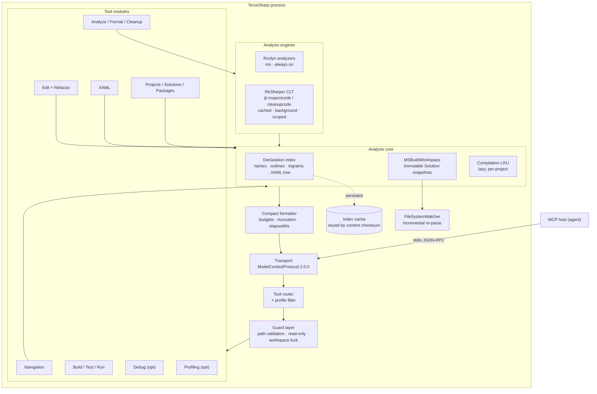
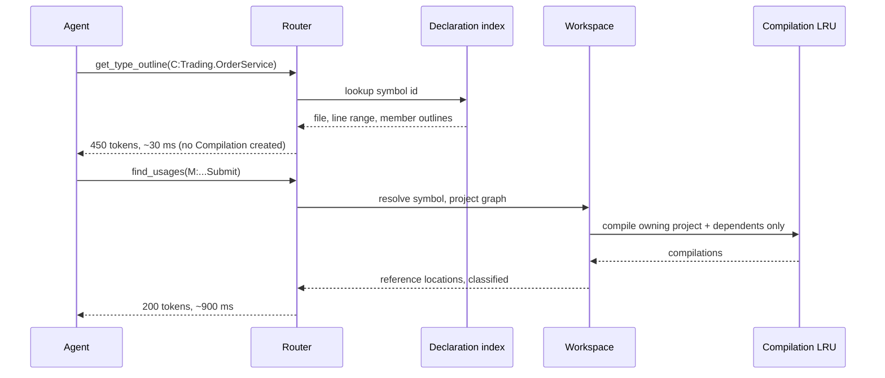
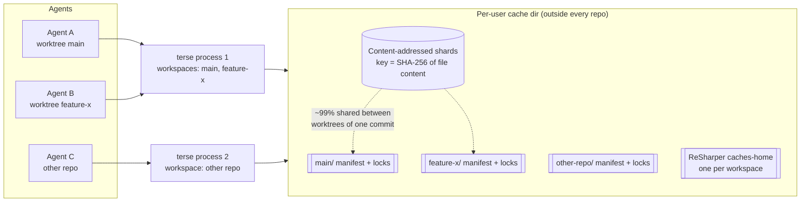

# TerseSharp — Design

Companion to `sharp-mcp-requirements.md`. Holds what the requirements deliberately do not: the
row-by-row Rider MCP parity matrix, the architecture, the performance design that backs the
"faster than Rider MCP" claim, tool schemas, alternatives considered, risks and phasing.

**Product name: TerseSharp** (CLI `terse`, NuGet `TerseSharp`) — researched and decided in
`sharp-mcp-requirements.md` §9. `sharp-mcp` remains only the working-directory name.

**Provenance:** greenfield — no code exists (repo verified empty 2026-07-30, `.idea` only).
Every path and type below is a **proposed** name, not a read one. Package versions, NuGet ID
availability and the Rider tool list are verified facts; everything else is DERIVED or ASSUMPTION
and marked where it matters.

Status legend: ✅ shipped · 🔜 planned · ⏸ deferred · ➖ dropped · ❌ blocked

---

## 1. Verified facts this design rests on

| Fact | Value | Source |
|---|---|---|
| MCP C# SDK | `ModelContextProtocol` **2.0.0** (2026-07-28); `.Core` and `.AspNetCore` siblings | NuGet gallery |
| Roslyn | `Microsoft.CodeAnalysis.CSharp.Workspaces` **5.6.0**; `Microsoft.CodeAnalysis.Workspaces.MSBuild` **5.3.0+** | NuGet gallery |
| Local SDK | **.NET 10.0.301** (`dotnet --version` on this machine) | measured |
| Known trap | `MSBuildWorkspace` fails on old-style .NET Framework projects when the NetFramework build host picks VS2026 MSBuild — `RemoteInvocationException` wrapping `TypeInitializationException` in `Microsoft.Build.Shared.XMakeElements` | [dotnet/roslyn#82931](https://github.com/dotnet/roslyn/issues/82931) |
| Required bootstrap | `MSBuildLocator.RegisterDefaults()` **before** touching `MSBuildWorkspace`; set `SkipUnrecognizedProjects = true`; subscribe `WorkspaceFailed` or loads fail silently with zero documents | Roslyn docs / community |
| Rider MCP surface | ~90 tools, enumerated live 2026-07-30 (§2) | running session |
| ReSharper engine | **ReSharper Command Line Tools** — `JetBrains.ReSharper.GlobalTools`, `jb inspectcode` / `jb cleanupcode`. Free, cross-platform, no IDE and no licence. Full inspection set at any severity via `--severity=SUGGESTION`; persistent `--caches-home`; `--project=` scoping | JetBrains CLT |
| MCP packaging | .NET 10 supports `<PackageType>McpServer</PackageType>` alongside `DotnetTool`, so a server can be run with `dnx <id>` **without prior install** | NuGet/MS Learn |
| Name availability | `TerseSharp` root and `TerseSharp.*` prefix = 0 hits; `CSharpMcp` taken; `DotnetMcp.*` prefix occupied | NuGet search API, 2026-07-30 |

### 1.1 Prior art

| Project | What it does | What we take | What we do differently |
|---|---|---|---|
| [`carquiza/RoslynMCP`](https://github.com/carquiza/RoslynMCP) | 5 tools: `SearchSymbols`, `FindReferences`, `GetSymbolInfo`, `AnalyzeDependencies`, `AnalyzeCodeComplexity`. .NET 8, Roslyn, multi-level caching. | The caching posture and the code-metrics tool (FR-54). | Read-only and tiny. We add the whole edit/refactor/clean half, and an explicit token budget. |
| [`HYMMA/csharp-lsp-mcp`](https://github.com/HYMMA/csharp-lsp-mcp) | 17 tools over **`csharp-ls`** (external LSP) + a hand-written XAML parser. Ships as a NuGet tool. | The distribution model; the XAML idea (⏸ v2). | It is an LSP bridge: LSP shapes (hover, completions, document symbols) are **position-based and verbose**, built for a cursor, not an agent. We own the Roslyn workspace directly, so we can return symbol-ID-addressed slices and do FixAll/Renamer work an LSP client cannot express. Its file-lock problem (must stop the server before rebuilding) is solved here by FR-7. |
| [`safishamsi/graphify`](https://github.com/safishamsi/graphify) | Popular generic code-knowledge-graph MCP. Tree-sitter AST over ~40 languages → `graph.json` + HTML + report. Per-file SHA-256 semantic cache, `--update` incremental, file watcher, multi-project registry (`~/.graphify/global-graph.json`, `--max-contexts` default 8), confidence-tagged edges (`EXTRACTED` / `INFERRED`), token budgets on tool outputs, `.graphifyignore` merged over `.gitignore`, `install`/`uninstall` across 20+ clients, opt-in JSONL query log. | **Six ideas taken** — see §3.5: content-addressed per-file cache · LRU multi-context server · confidence tagging (→ our `EXACT`/`HEURISTIC`, FR-189) · bisect-on-oversize instead of failing (FR-183) · ignore-file merge semantics (FR-187) · one-command install **and uninstall** (FR-195). | Generic and language-agnostic; we are C#-specific and semantic (Roslyn, not tree-sitter), so we can answer *"who calls this"* exactly rather than approximately, and we can edit. **Its setup pain is our anti-requirement list (FR-191–195):** package named `graphifyy` but command `graphify`; MCP support itself an optional extra; `PATH` breakage from pipx/pip; a feature lost on Python 3.13+; API keys needed for part of indexing; `/graphify .` vs `graphify .` on PowerShell. Also, it commits `graphify-out/` and needs a git **merge driver** to survive parallel commits — we keep the index out of the repo entirely (FR-188), which deletes that problem instead of solving it. |
| JetBrains Rider MCP | ~90 tools, IDE-hosted | The tool taxonomy — it is the most complete .NET agent surface that exists, hence the parity requirement. | No IDE, no licence, headless, and specified to be faster (§3). |

---

## 2. Rider MCP parity matrix

Every tool in the current Rider MCP surface, with its TerseSharp counterpart and the FR that defines
it. **AC-11 gates this table**: no row may be left without a verdict.

### 2.1 Search, navigation, symbols — ✅ superset

| Rider tool | TerseSharp | FR |
|---|---|---|
| `search_symbol` | `search_symbols` | FR-8 |
| `get_symbol_info` | `get_symbol` | FR-9 |
| `search_text` | `search_text` | FR-23 |
| `search_regex` | `search_regex` | FR-23 |
| `search_file` | `find_files` | FR-24 |
| `list_directory_tree` | `list_directory_tree` | FR-24 |
| `read_file` | `get_file_text` (line-ranged) | FR-25 |
| `get_class_hierarchy` | `get_type_hierarchy` (+ alias `get_class_hierarchy`) | FR-16, FR-93 |
| `analyze_calls` | `get_call_hierarchy` (+ alias `analyze_calls`) | FR-17, FR-93 |
| `find_default_value_overrides` | same name | FR-26 |
| `get_all_open_file_paths` | `list_active_files` — redefined, no editor exists | FR-91 |
| `open_file_in_editor` | ➖ no editor; tool absent, not stubbed | FR-94 |
| — | **`get_type_outline`, `get_file_outline`, `get_symbol_source`, `find_implementations`, `find_overrides`, `find_dependents`, `find_symbols_by_attribute`, `get_namespace_tree`** — Rider MCP has no equivalent | FR-10, 11, 12, 15, 18, 22, 20, 21 |

### 2.2 Edit, refactor, cleanup — ✅ superset

| Rider tool | TerseSharp | FR |
|---|---|---|
| `create_new_file` | `create_file` (+ project registration) | FR-36 |
| `apply_patch` | `apply_patch` | FR-41 |
| `rename_refactoring` | `rename_symbol` | FR-42 |
| `extract_method` | `extract_method` | FR-43 |
| `extract_interface` | `extract_interface` | FR-44 |
| `extract_base_class` | `extract_base_class` | FR-44 |
| `move_type_to_namespace` | `move_type_to_namespace` (+ to-file, to-project) | FR-45 |
| `change_api_signature` | `change_signature` | FR-46 |
| `safe_delete` | `delete_symbol` | FR-35 |
| `reformat_file` | `format_document` (+ alias `reformat_file`) | FR-39, FR-92 |
| `reorganize_namespaces` | `organize_imports` (+ alias) | FR-40, FR-92 |
| — | **`replace_symbol_body`, `replace_symbol`, `add_member`, `apply_text_edit`, `add_using`, `cleanup_code`, `find_dead_code`, `apply_fix_all`, `inline_method`, `pull_up_member`, `encapsulate_field`, `code_metrics`** — no Rider MCP equivalent | FR-32–34, 37, 38, 51–54, 47–49 |

### 2.3 Problems, lint, quality — ✅ superset

| Rider tool | TerseSharp | FR |
|---|---|---|
| `get_file_problems` | `get_diagnostics(scope=file)` | FR-27 |
| `get_project_problems` | `get_diagnostics(scope=project\|solution)` | FR-27 |
| `lint_files` | `lint_files` | FR-71 |
| `post_edit_quality_check` | `post_edit_quality_check` | FR-72 |
| — | **info/suggestion severity** — Rider's MCP caps at warning and ignores the "This computer" severity layer; ours does not | FR-73 |
| — | **cross-TFM dedup** with occurrence counts | FR-28 |

### 2.4 Build, run, projects, VCS — ✅ equivalent

| Rider tool | TerseSharp | FR |
|---|---|---|
| `build_solution_start` / `build_solution_state` | `build_start` / `build_state` (plus synchronous `build`) | FR-70, FR-55 |
| `get_solution_projects` | `list_projects` | FR-5 |
| `get_project_dependencies` | `project_dependencies` (+ cycle detection) | FR-6 |
| `get_run_configurations` | `list_run_configurations` | FR-68 |
| `execute_run_configuration` | `run_configuration` | FR-68 |
| `execute_terminal_command` | `run_process` — output-capped, exit-code-aware, never blind-waits | FR-69 |
| `git_status` | `git_status` / `git_diff` | FR-58 |
| `get_repositories` | `list_repositories` | FR-58 |
| — | **`run_tests` returning failures only** | FR-56 |

### 2.5 Debugger — 🔜 equivalent via netcoredbg + ClrMD

Rider's MCP exposes its debugger under `xdebug_*` names plus `attach_to_process` / `ignore_exception`.

| Rider tool | TerseSharp | FR |
|---|---|---|
| `xdebug_start_debugger_session` | `debug_start` | FR-74 |
| `attach_to_process`, `xdebug_attach_to_process` | `debug_attach` | FR-74 |
| `xdebug_set_breakpoint` / `remove_breakpoint` / `list_breakpoints` | `debug_set_breakpoint` / `debug_remove_breakpoint` / `debug_list_breakpoints` | FR-75 |
| `xdebug_control_session`, `xdebug_run_to_line` | `debug_control` | FR-76 |
| `xdebug_get_debugger_status` | `debug_status` | FR-77 |
| `xdebug_get_threads`, `xdebug_get_stack` | `debug_get_threads`, `debug_get_stack` | FR-77 |
| `xdebug_get_frame_values`, `xdebug_get_value_by_path` | `debug_get_frame_values`, `debug_get_value_by_path` | FR-78 |
| `xdebug_evaluate_expression`, `xdebug_set_variable` | `debug_evaluate`, `debug_set_variable` | FR-78 |
| `xdebug_memory_dump` | `debug_memory_dump` + `dump_analyze` (ClrMD, superset) | FR-79 |
| `ignore_exception` | `debug_ignore_exception` | FR-80 |
| `xdebug_start_mixed_mode_debug` | `debug_start_mixed_mode` — degraded where netcoredbg cannot, and it says so | FR-81 |

### 2.6 dotTrace profiling — 🔜 equivalent via dotnet-trace + TraceEvent

| Rider tool | TerseSharp | FR |
|---|---|---|
| `dotTraceOpenReport` | `trace_open` | FR-83 |
| `dotTraceGetSnapshotInfo` | `trace_info` | FR-83 |
| `dotTraceGetCallTree` | `trace_call_tree` (percent-filtered) | FR-84 |
| `dotTraceGetTimeline`, `dotTraceGetTimelineEvents` | `trace_timeline`, `trace_events` | FR-85 |
| `dotTraceGetSnapshotFilters` | `trace_events(filter=…)` | FR-85 |
| — | **`trace_collect`, `counters`** — Rider MCP can only read snapshots, not take them | FR-82, FR-86 |

> ⚠️ dotTrace snapshots (`.dtp`) are a **proprietary format**. TerseSharp reads `.nettrace` (open,
> EventPipe). It is an *equivalent capability*, not a file-format-compatible one. Opening an existing
> dotTrace snapshot is ❌ blocked and will stay so.

### 2.7 Database — ➖ dropped on request

All 13 tools (`*_database_connection`, `list_database_schemas`, `list_schema_object_kinds`,
`list_schema_objects`, `get_database_object_description`, `introspect_schema`, `execute_sql_query`,
`fetch_query_result`, `cancel_sql_query`, `preview_table_data`, `list_recent_sql_queries`) are **not
implemented**. They are DataGrip functionality bundled into Rider: no C# relevance, no token saving,
and they would add credential storage and arbitrary SQL execution to a code server. Recorded so the
decision is not re-litigated (requirements §4.12, Q8).

### 2.8 Not reproducible — ➖ with reasons

| Rider tool | Verdict |
|---|---|
| `search_assets`, `get_asset_properties`, `search_tags` | ➖ read Unity's live asset database via the JetBrains Unity plugin. No headless equivalent. |
| `spawn_actor`, `viewport_camera` | ➖ drive a running Unreal/Unity editor's scene and camera. |
| `take_screenshot` | ➖ captures the IDE/editor window. Nothing to capture. |
| `execute_tool`, `skill_search` | ➖ host-side dispatch and skill lookup — the MCP host already owns both (FR-95). |

**Totals:** 90 Rider tools → **62 equivalent or superset** · **23 planned via open-source .NET
backends** (debug 17, profiling 6) · **13 dropped on request** (database) · **6 not reproducible**
(game engine) · **2 host-owned**, **1 editor-only**.

### 2.9 Beyond Rider MCP entirely

Four capability areas exist in TerseSharp with **no Rider MCP counterpart at all** — they are where
most of the token saving comes from:

| Area | Why Rider MCP has nothing | FR |
|---|---|---|
| **Outline tools** — `get_type_outline`, `get_file_outline`, `get_symbol_source`, `outline_file` | Rider's MCP returns whole files; outlines are the single biggest token win | FR-10–12, FR-97 |
| **XAML as a semantic surface** — 20+ tools: outline, semantic find, binding validation against the DataContext type, resource-key rename, extract control, format, cleanup | Rider has XAML support in the IDE; its **MCP surface does not expose any of it** | §4.18 |
| **Full ReSharper analysis + cleanup headlessly** — via the free CLT, at every severity down to HINT, honouring all `.DotSettings` layers | Rider's MCP caps at WARNING and ignores the "This computer" settings layer | §4.19 |
| **Project / solution / package structural editing** — `.sln`, `.csproj`, CPM-aware package operations, MSBuild property provenance | Rider's MCP has no project-file tools; the agent shells out to `dotnet` | §4.15 |

---

## 3. Performance design — why this is faster than Rider MCP

### 3.1 Where Rider's latency comes from

Rider MCP's floor is structural, not a tuning failure. A call travels:

```
agent → MCP client → Rider MCP plugin (JVM) → RD protocol → Rider backend (ReSharper, .NET)
      → ReSharper caches → back through RD → JVM → MCP response
```

…on a process that is simultaneously running a GUI, an indexer, continuous inspections and a
solution-wide analysis daemon, and that requires the solution to be **open in a licensed IDE**.

TerseSharp:

```
agent → MCP client → TerseSharp process → Roslyn workspace / index → response
```

One process. No protocol hop. No UI thread. Nothing else competing for the cores.

### 3.2 Architecture



### 3.3 The seven mechanisms behind the numbers

| # | Mechanism | Buys | NFR |
|---|---|---|---|
| M1 | **Index-first** — a syntax-level declaration index (name → symbol id → file:line, plus per-file outlines) built from `SyntaxTree`s only. `search_symbols` / `get_*_outline` never touch a `Compilation`. | The 4 hottest tools drop from "semantic" cost to a dictionary lookup — the ≤ 25 % target. | NFR-18 |
| M2 | **Persisted index cache** keyed by solution path + content checksum of all `.cs` + project files. Second cold start ≤ 5 s instead of ≤ 180 s. | Agents restart constantly; Rider's caches are not reusable by a headless process. | NFR-17 |
| M3 | **Minimum compilation set** — semantic tools compile the symbol's project plus its *dependents* (from the project graph), never the solution. | `find_usages` on a leaf project stays sub-second on a 100-project solution. | NFR-18 |
| M4 | **Incremental re-parse** — Roslyn's `SyntaxTree.WithChangedText` reuses unchanged nodes; only dependent compilations invalidate. | Edit→query round-trip ≤ 500 ms. | NFR-19 |
| M5 | **Result cache** keyed by (tool, normalized args, `Solution` version). | Repeat queries ≤ 5 ms; agents repeat constantly. | NFR-22 |
| M6 | **Parallel fan-out** — project load, index build and `find_usages` across `Environment.ProcessorCount`, results into a bounded `Channel`. | Wall-clock on multi-project work. | NFR-21 |
| M7 | **Compact formatting on a pooled buffer** — `ArrayPool`, `Span` formatting, no LINQ materialization per result, invariant culture. | Removes serialization from the hot path; also serves the token budget. | NFR-23, NFR-11 |

### 3.4 Query flow — the fast path vs the semantic path



### 3.5 Multi-workspace, parallel worktrees, and crash safety

The requirement: several agents, several git worktrees of one .NET repo, several unrelated repos —
concurrently, on one machine, without corruption or lock fights (§4.20).

**Two deployments, one mechanism.** Whether the user runs *one server holding four workspaces* or
*four servers holding one each*, the on-disk contract is identical, so both are safe and they can be
mixed.



**Why content-addressing is the whole trick.** Two worktrees of the same commit contain byte-identical
files. Keying index shards by **content hash rather than path** means worktree B's index is ~99 %
already on disk when it opens: the manifest is per-workspace (paths, project graph, branch), the
expensive parsed data is global and shared. NFR-32 budgets this at ≥ 95 % reuse and ≤ 10 s.
This is graphify's per-file SHA-256 cache, generalised from "skip re-parsing unchanged files in one
project" to "share parsed files across every checkout on the machine".

**Concurrency rules, in one place:**

| Concern | Rule |
|---|---|
| Shard writes | Temp file in the same directory → `fsync` → atomic rename. Never in place. (FR-176) |
| Shard reads | Lock-free. Content-addressed shards are immutable; a hash mismatch means *rebuild that shard*, never *fail the call*. (FR-181) |
| Workspace mutation | One advisory write-lock per workspace, carrying owner PID + heartbeat. Stale or dead-owner locks are reclaimed automatically and logged. Never held across a tool-call boundary. (FR-177) |
| ReSharper CLT | One `--caches-home` **per workspace**. JetBrains caches are not concurrency-safe and sharing them across worktrees is a corruption bug waiting to happen. (FR-179) |
| MSBuild | Node reuse **disabled**. A reused node carries state from another worktree. (FR-179) |
| NuGet restore | Serialized per global-packages folder by the same lock type. (FR-179) |
| Memory & workers | Bounded **process-wide**, not per workspace; LRU-evict a workspace before approaching the ceiling. (FR-180, NFR-31) |
| Failure blast radius | Per-workspace. A workspace that fails to load, or whose analyzer dies, is marked failed; the others keep serving. (FR-185, NFR-35) |

**Crash-only.** There is no shutdown path required for correctness. Atomic writes plus versioned,
checksummed shards mean a `SIGKILL` at any instant leaves valid state; startup does nothing but drop
stale locks. NFR-34 proves it with 500 kill cycles.

**What we deliberately did *not* copy from graphify:** committing the index to the repo. It ships
`graphify-out/` in git and needs a union **merge driver** so two developers' graphs don't conflict.
A machine-local, content-addressed index has no business in version control — keeping it out
(FR-188) removes the merge problem, the review noise, and the "someone committed a 512 MiB JSON"
incident, at the cost of each machine building its own index once (which content-addressing already
makes cheap).

### 3.6 Benchmark method (NFR-14 / AC-13)

1. Fixture: one committed 10-project solution (CI) + one large real solution (release-time only).
2. Query set, 12 operations, 100 runs each, warm, interleaved A/B to cancel machine drift.
3. Measure **end-to-end MCP call latency** at the client — not internal timers — so the protocol hop
   Rider pays is counted, because the agent pays it.
4. Report p50/p95/p99 per tool, both servers, plus response size in tokens.
5. CI enforces the **absolute** budgets (NFR-16). The **ratio** (NFR-15) is verified per release on a
   machine with Rider licensed and the solution open, and the report ships with the release.

> ⚠️ This comparison is only honest if Rider is **warm** — solution open, indexing finished. A
> cold-Rider comparison would flatter us and would be rejected by anyone who checks.

---

## 4. Key contracts

### 4.1 SymbolId

Roslyn's `DocumentationCommentId` — already stable, already round-trippable
(`DocumentationCommentId.GetFirstSymbolForDeclarationId`), already familiar to the model from XML doc
`cref`s.

```
T:Trading.OrderService                                  type
M:Trading.OrderService.Submit(Trading.Order)            method
P:Trading.OrderService.PendingCount                     property
F:Trading.OrderService._repo                            field
E:Trading.OrderService.Submitted                        event
N:Trading                                               namespace
```

Ambiguity (same id in two projects / two TFMs) is resolved by an optional `project:` prefix:
`myproj/M:Trading.OrderService.Submit(Trading.Order)`. An ambiguous id without a prefix returns a
distinct `AMBIGUOUS_SYMBOL` error listing the candidates — never a silent first-match.

**Why not file:line:col as the primary handle:** it goes stale on every edit above it, which is
precisely the failure mode that makes line-addressed `Edit` expensive. Positions remain supported as
an *input* (FR-14, FR-19) to bridge from a stack trace or a diff, and every such tool returns the
SymbolId so the agent can switch to the stable handle immediately.

### 4.2 Response envelope

Line 1 is a header, then records, then an optional trailer. No JSON wrapper in `format=text`.

```
<tool> <primary arg>
<n> results in <m> files (truncated=<bool>[, total=<n>][, cursor=<c>])

<record>
...
[elapsedMs=<n>]
```

`detail` levels, on every read tool: `id` (SymbolIds only) · `signature` (default) · `outline` ·
`full`. The default is always the smallest level that answers the question the tool exists for.

### 4.3 Error model (NFR-8)

| Code | Meaning | Remedy line returned |
|---|---|---|
| `WORKSPACE_NOT_LOADED` | no `load_workspace` yet | "call load_workspace(path)" |
| `WORKSPACE_PARTIAL` | some projects failed | names the projects + reason |
| `SYMBOL_NOT_FOUND` | id does not resolve | suggests the 3 nearest by edit distance |
| `AMBIGUOUS_SYMBOL` | id resolves in >1 project/TFM | lists prefixed candidates |
| `EDIT_CONFLICT` | document changed since the snapshot | "re-read and retry" |
| `COMPILE_REGRESSION` | edit introduced a new error, rolled back | the error + `allowErrors=true` |
| `GENERATED_DOCUMENT` | target is source-generated | names the generator |
| `OUT_OF_WORKSPACE` | path escapes the root | the resolved path |
| `READ_ONLY` | mutating tool under `--read-only` | — |
| `TIMED_OUT` | analysis budget exceeded | partial results + what was skipped |

An empty result is always distinguishable from a failed one. There is no "success with nothing".

### 4.4 Proposed layout

```
src/
  TerseSharp.Core/             Workspace registry (LRU), declaration index, symbol resolution,
                               formatter, errors, EXACT/HEURISTIC tagging
  TerseSharp.Storage/          Content-addressed shard store, manifests, atomic writes,
                               heartbeat locks, shard GC — the concurrency substrate (§3.5)
  TerseSharp.Tools.Navigation/
  TerseSharp.Tools.Editing/    semantic edits + refactorings
  TerseSharp.Tools.Analysis/   analyze / format / cleanup — Roslyn + ReSharper CLT engines
  TerseSharp.Tools.Xaml/       XAML model, validation, refactor, format, cleanup
  TerseSharp.Tools.Projects/   .sln / .csproj / packages / MSBuild evaluation
  TerseSharp.Tools.Build/      build, test, run configurations, process
  TerseSharp.Tools.Files/      non-C# read/write/search — the no-fallback set
  TerseSharp.Tools.Debug/      optional — netcoredbg + ClrMD
  TerseSharp.Tools.Profiling/  optional — dotnet-trace + TraceEvent
  TerseSharp.Server/           host, transport, router, profiles, CLI, `terse install`/`doctor`
tests/
  TerseSharp.UnitTests/  .IntegrationTests/  .E2ETests/  .Benchmarks/  .TokenBudget/
fixtures/
  FixtureSolution/    multi-TFM · source generator · unloadable project · CPM · console app for debug
  FixtureUi/          WPF + Avalonia + WinUI views: bindings, resources, merged dictionaries, themes
  FixtureSmells/      one seeded instance of every FR-155 inspection family
```

**Why `.E2ETests` is the largest project by test count:** NFR-26 requires one named E2E test per
advertised tool (~95 in `full`), each driving a separate server process over the real transport.
The suite is the definition of done, not a safety net.

---

## 5. Alternatives considered

| Decision | Options | DECISION |
|---|---|---|
| Workspace backend | (a) `MSBuildWorkspace` · (b) hand-rolled `.csproj` reader + `AdhocWorkspace` · (c) wrap `csharp-ls` over LSP (as `csharp-lsp-mcp` does) | **(a)**. (b) is faster to load and wrong on anything non-trivial (globs, imports, CPM, generators). (c) inherits LSP's position-based, verbose shapes and cannot express FixAll or `Renamer` — the exact things that make this worth building. Cost of (a) is load time, budgeted in NFR-2 and mostly erased by the persisted index (M2). |
| Symbol handle | (a) `DocumentationCommentId` · (b) custom id · (c) file:line:col | **(a)** — stable, standard, human-readable, already in the model's training distribution. |
| Default response format | (a) compact text · (b) JSON · (c) JSON with a text fallback | **(a)**. JSON costs 2–3× for identical information; MCP does not require it. `format=json` stays available for programmatic clients. |
| Tool naming | (a) unprefixed · (b) `sharp_` prefix | **(a)**, with deliberately distinct names, plus Rider-named aliases (FR-92, FR-93) so an agent used to Rider's surface lands on the right tool. Revisit on an observed collision. |
| Debugger backend | (a) netcoredbg · (b) vsdbg · (c) ClrMD only (post-mortem) | **(a)** for live, **(c)** additionally for dumps. (b) is more complete but its licence forbids redistribution outside Microsoft tooling — unshippable. |
| Profiling backend | (a) dotnet-trace + TraceEvent · (b) read dotTrace `.dtp` | **(a)**. (b) is a proprietary format; ❌. |
| Index storage | (a) custom binary + checksum key · (b) SQLite · (c) rebuild every start | **(a)** — smallest dependency, fastest load. (b) adds a dependency for a write-once-read-many blob. (c) forfeits NFR-17, the biggest single win over Rider for a restarting agent. |
| ~~Process model~~ | (a) one workspace per process · (b) one server, many workspaces | **SUPERSEDED.** The original answer was (a) for v1. The parallel-worktree requirement kills it: an agent per worktree plus an agent per repo means several processes *and* several workspaces regardless of what we prefer. **New decision: both, from v1** — LRU multi-workspace in-process (FR-169) *and* a concurrency-safe on-disk contract so N processes coexist (FR-172, §3.5). Memory is bounded process-wide (FR-180). Refuted answer kept so it is not re-proposed. |
| Index key | (a) path-keyed shards · (b) **content-addressed** (SHA-256 of file content) | **(b)**. (a) is simpler but re-indexes every worktree from scratch. (b) makes a second worktree of the same commit ~95 % free (NFR-32) and makes shards immutable, which is what allows lock-free concurrent reads (FR-178). Cost: a hash per file per change, and a garbage-collection step for orphaned shards. |
| Cache location | (a) per-user cache dir outside the repo · (b) in-repo and committed, à la `graphify-out/` | **(a)** (FR-188). (b) is graphify's model and forces a git **merge driver** to stop parallel commits conflicting, puts machine-local state in review, and risks a huge blob in history. Content-addressing already makes per-machine rebuild cheap, so (b) buys nothing we need. |
| Workspace disambiguation | (a) pick the most-recently-used on ambiguity · (b) error and list candidates | **(b)** (FR-170). Silently answering from the wrong worktree of the same repo is undetectable by the agent and produces confidently wrong edits. An error costs one round trip; a wrong worktree costs a bad commit. |
| Crash safety | (a) journal + recovery pass on start · (b) **crash-only**: atomic renames + versioned checksummed shards | **(b)** (FR-182). A recovery pass is code that runs rarely and is therefore usually broken. Atomic-rename + "bad shard rebuilds itself" needs no recovery path at all. |
| **ReSharper parity** | (a) shell the free **ReSharper CLT** (`jb inspectcode`/`cleanupcode`) and normalize its output · (b) re-implement the inspections on Roslyn · (c) claim parity via Roslyn analyzers alone | **(a)**. (b) is ~2,500 inspections — years of work and permanently behind. (c) is false advertising: no Roslyn equivalent exists for `UnusedMember.Global`, `PossibleMultipleEnumeration`, most redundancy/naming families, or ReSharper's formatter. Cost of (a) is latency, hidden by FR-158/159/160. Trade-off accepted knowingly: an external process on a slow path, against a *true* parity claim. |
| ReSharper result freshness | (a) block until `jb` finishes · (b) `auto` — Roslyn now, ReSharper from cache, background refresh | **(b)** (FR-158). Blocking a 40 ms question behind a 3-minute solution inspection violates the prime directive. The header always states which engines answered, so a stale result is never mistaken for a complete one. |
| XAML model | (a) `System.Xaml`/`XamlXmlReader` · (b) `XDocument` with line info + a type layer resolved through Roslyn · (c) text/regex | **(b)**. (a) is WPF-flavoured and drags in WindowsDesktop — it cannot serve Avalonia/MAUI/WinUI or run on Linux. (c) is what agents do today and is exactly what this product exists to replace. (b) gives line-accurate positions, byte-preserving edits, and joins to real C# symbols for binding validation. |
| XAML dialects | (a) WPF only · (b) WPF + Avalonia + WinUI + MAUI with detection | **(b)** — a WPF-only XAML surface would silently mis-analyse half the .NET UI world. Unsupported constructs report UNKNOWN rather than passing (FR-150). |
| Text search | (a) own trigram index · (b) shell out to `ripgrep` | **(a)** (FR-98, Q10). (b) costs a process spawn per call and forfeits the no-fallback goal; the index is already being built for symbols. |
| Product name | see requirements §9 | **TerseSharp** — signals C#/.NET via "Sharp", states the prime directive via "Terse", and is the only shortlisted candidate verified free on both NuGet root and prefix. |

---

## 6. Risks

| # | Risk | Impact | Mitigation |
|---|---|---|---|
| R1 | `MSBuildWorkspace` slow or failing on large/legacy solutions (roslyn#82931) | The whole product stalls at step one | `SkipUnrecognizedProjects`, `WorkspaceFailed` surfaced (FR-1), partial-load is a success with a named failure (AC-4), TC-14 pins the legacy case |
| R2 | The speed claim does not hold on some tool | Core promise fails | NFR-15 is a **release blocker**; measure early, in phase 1, before the surface grows |
| R3 | Persisted index goes stale after a branch switch | Wrong answers — worse than slow answers | Content checksum, not mtime (Q7); per-project invalidation; TC-17 |
| R4 | Tool-surface bloat eats the context it was meant to save | Net negative for the user | Profiles (NFR-5b), modules off by default, AC-16 enforces the token ceiling |
| R5 | Memory on 200-project solutions | OOM in CI/containers | Weak compilation LRU (NFR-6, NFR-23), TC-15 |
| R6 | Source generators: mutating a generated document | Silent data loss | Generated docs read-only, refused by name (NFR-9) |
| R7 | File locks blocking the user's own build | Workflow breakage — the exact complaint against `csharp-lsp-mcp` | `unload_workspace` (FR-7); never hold an MSBuild node open between calls |
| R8 | Debug/profiling modules consume the schedule | Core ships late or half-done | Both are P2/P3, off by default, and built last (phase P8). The database module was already cut. |
| R11 | **ReSharper CLT latency** — a solution-wide `jb inspectcode` takes minutes and would destroy the speed claim if it sat on the request path | The product's headline promise fails on its headline feature | `engine=auto` never blocks (FR-158); persistent `--caches-home` + `--project=` scoping + content-hash result cache (FR-159); background re-inspection (FR-160); the header always declares which engines answered |
| R12 | The CLT is a JetBrains-controlled external dependency — version drift, output-schema changes, install failure | Analysis parity silently degrades | Pin the tool version; parse SARIF/XML defensively with a schema test in CI; on absence, degrade to `engine=roslyn` **and say so in every response header** (FR-161) — never silently return fewer findings |
| R13 | XAML dialect coverage — WPF vs Avalonia (`CompiledBinding`, selectors) vs WinUI (`x:Bind`) vs MAUI diverge | Wrong analysis on half the .NET UI world, delivered confidently | Per-project dialect detection reported in every response; unsupported constructs reported UNKNOWN, never silently accepted (FR-150); TC-30 tests Avalonia and WinUI explicitly |
| R14 | XAML binding validation depends on resolving the DataContext type, which is often set at runtime or via a locator | False positives — worse than no validation, they train the agent to ignore the tool | Report only when the DataContext type is **resolved with confidence**; when it is not, say `DataContext unresolved` once per file and validate nothing else there (FR-133) |
| R16 | **Shared-cache corruption under parallel processes** — the classic multi-worktree failure | Wrong answers across every workspace on the machine; worse than a crash | Immutable content-addressed shards, atomic temp+rename writes, per-shard checksums that rebuild rather than fail, lock-free reads, write-locks with PID + heartbeat and automatic stale reclamation (FR-176–178, FR-181). Proven by the 8×3×30 min soak (NFR-33) and 500 kill cycles (NFR-34) |
| R17 | **Answering from the wrong worktree** — same repo, same symbol IDs, different code | Confidently wrong edits committed to the wrong branch; near-undetectable | `workspace` on every tool, containment-based resolution, `AMBIGUOUS_WORKSPACE` error rather than a guess, branch + worktree name in every workspace header (FR-170, FR-173, AC-31) |
| R18 | **External tools that are not concurrency-safe** — shared ReSharper caches, reused MSBuild nodes, concurrent NuGet restore | Corrupt analysis caches and cross-worktree build contamination, appearing as flaky nonsense | `--caches-home` per workspace, MSBuild node reuse disabled, restore serialized on the global-packages folder (FR-179, TC-45) |
| R19 | **Memory blow-up with N workspaces** — 4 × a 4 GB budget is not a budget | OOM on the developer's own machine while they are working | Process-wide ceilings for memory, workers and the compilation LRU; evict the least-recently-used workspace *before* the ceiling (FR-180, NFR-31) |
| R20 | Orphaned shards accumulate as branches churn | Cache dir grows without bound | Reference-counted manifests + a background GC of unreferenced shards; `terse cache clear` as the manual escape hatch (FR-195) |
| R15 | The E2E-per-tool mandate (~95 processes, real workspaces) makes CI slow | The mandate gets watered down under schedule pressure | Share one loaded fixture workspace per test class, run classes in parallel, keep the heavy fixtures (200-project, Rider comparison) out of PR CI and on a nightly job |
| R9 | Edits corrupt a file on a crash mid-write | Data loss | Write via temp file + atomic replace; snapshot retained for `undo_last_change` (FR-63); TC-13 |
| R10 | Concurrency bug returns a half-applied solution | Wrong code shipped by an agent | Single-writer lock, immutable snapshots for readers (NFR-7), AC-8 |

---

## 7. Phasing

| Phase | Scope | Exit criterion |
|---|---|---|
| **P1 — Walking skeleton** | `load_workspace`, `list_projects`, `search_symbols`, `get_file_outline`, `get_type_outline`, `get_symbol`, `get_symbol_source`, stdio transport, compact formatter, token harness | AC-1 passes; **and the comparative benchmark already runs** (R2 — do not defer this) |
| **P2 — Semantic navigation + the concurrency substrate** | `find_usages`, `goto_definition`, `find_implementations`, hierarchies, declaration index, **content-addressed shards, atomic writes, heartbeat locks, multi-workspace LRU, worktree awareness, `EXACT`/`HEURISTIC` tagging**, file watcher | AC-6, AC-14, AC-15, **AC-31 → AC-36** pass; the soak (NFR-33) and kill (NFR-34) suites run nightly from here on |
| **P3 — Edit + safety** | `replace_symbol_body/_symbol`, `add_member`, `delete_symbol`, `create_file`, dryRun, compile gate, rollback, undo | AC-3 passes; no tool can leave a file uncompilable |
| **P4 — Refactor + diagnostics** | `rename_symbol`, `change_signature`, extract/move family, `get_diagnostics`, `lint_files`, code fixes, `cleanup_code` | AC-2, AC-7, TC-24 pass |
| **P5 — Full analysis + cleanup** | ReSharper CLT integration, `analyze`, `analyze_rules`, `suppress`, `format`, `cleanup`, the two-engine dedup, the caching/background machinery | AC-27, AC-28, AC-29, AC-30 pass; the FR-155 seeded fixture is fully detected |
| **P6 — Build/test/run, projects, no-fallback** | `build`, `run_tests` + `test_rerun_failed`, run configurations, `.sln`/`.csproj`/package tools, the non-C# file and text tools, profiles, `--read-only` | AC-17 (no-fallback task), AC-19, AC-20 pass |
| **P7 — XAML** | model, outline, semantic find, bindings, validation, renames, extract, format, cleanup, dialects | AC-22 → AC-26 pass |
| **P8 — Packaging + parity modules** | global tool + `McpServer` package, `terse install` / `doctor`, the agent skill, then debug and profiling | AC-12, AC-18 pass; then AC-11: every parity-matrix row has a shipped tool or a written verdict |

**Ordering rationale:** packaging (P8) is late because the install story only matters once there is
something worth installing — but AC-18's clean-container test runs from P1 against whatever exists,
so it never becomes a big-bang integration at the end. The E2E-per-tool mandate (NFR-26) applies
**within every phase**: a phase does not exit with an untested tool.

---

*Local working note — do NOT commit/push. Companion: `sharp-mcp-requirements.md`.*
